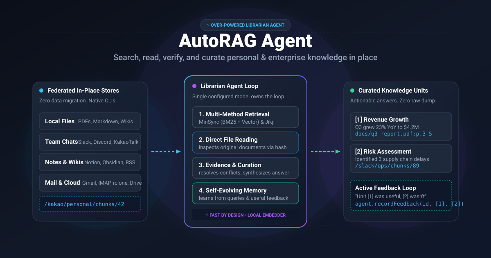
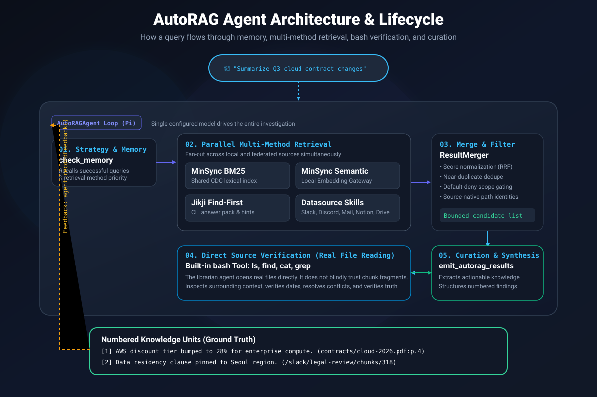

# AutoRAG Agent

**Now your agent can find anything in your computer.**

<p align="left">
  <a href="https://www.npmjs.com/package/@autorag/librarian"></a>
  <a href="https://www.npmjs.com/package/@autorag/librarian"></a>
  <a href="https://github.com/Marker-Inc-Korea/AutoRAG/stargazers"></a>
  <a href="https://github.com/Marker-Inc-Korea/AutoRAG/actions/workflows/ci.yml"></a>
  <a href="LICENSE"></a>
  = 24" />
  = 1.2" />
</p>

<!-- Concept Thumbnail Placeholder -->
<p align="center">
  
</p>
<!-- Placeholder: Replace assets/concept-thumbnail.svg with high-resolution banner art if desired -->

> [!IMPORTANT]
> **Looking for the original AutoRAG (RAG AutoML / pipeline optimization tool)?**
> This repository now hosts **AutoRAG 2.0**, a complete reimagining of AutoRAG as a self-evolving librarian agent. The original Python-based AutoRAG — the RAG AutoML tool for automatically finding an optimal RAG pipeline for your data — now lives in the [`legacy/`](legacy/) directory of this repository.
>
> **The legacy AutoRAG is NOT abandoned.** It continues to be maintained (bug fixes, dependency updates, and PyPI releases via `pip install AutoRAG`) in maintenance mode. Existing users can keep using it exactly as before — see the [legacy README](legacy/README.md) for its documentation, and file issues in this repository as usual. New feature development is focused on AutoRAG Agent (2.0).

---

## What is AutoRAG Agent?

Search tools dump file paths and matching lines — forcing you to open files, read context, and synthesize answers yourself.

**AutoRAG Agent is a self-evolving librarian agent.** Built on the [Pi](https://github.com/earendil-works/pi-mono) agent framework, a single configured model searches across multiple retrieval methods, opens source documents directly via `bash` to verify ground truth, and curates answers into clean, numbered knowledge units:

```text
You ask:  "What changes were made to the cloud infrastructure contract in Q3?"

AutoRAG Agent:
[1] Enterprise Compute Discount — AWS annual discount tier increased to 28% based on commitment volume. (contracts/cloud-2026.pdf:p.4)
[2] Regional Data Residency — Explicit compliance clause pinning customer data storage to the Seoul AWS region. (/slack/legal-ops/chunks/318)
[3] SLA Guarantee — Guaranteed uptime threshold adjusted to 99.95% with penalty credits starting at 15 minutes downtime. (contracts/sla-addendum.md:lines 45-62)
```

---

## Core Values

Three principles drive every design decision in AutoRAG Agent:

1. **Never migrate your data to search it.** Traditional RAG systems force you to upload, ETL, and duplicate your files into a centralized vector database. AutoRAG Agent federates your data **in place**, querying CLI-native stores (`katok`, `discrawl`, `slacrawl`, `mailcrawl`, `rclone`, `qmd`) where your data already lives. Results retain opaque, source-native identities (`/kakao/...`, `/slack/...`) that preserve local access control and privacy. *(See our [Competitive Landscape Study](docs/competitive-landscape-2026-09.md) on why in-place federation is the durable differentiator).*

2. **Just works — no RAG degree required.** No pipeline tuning, no vector-DB maintenance, and no remote embedding API keys. AutoRAG Agent automatically manages [MinSync](docs/minsync-setup.md) for incremental Change Data Capture (CDC) chunking and provides a local [embedding gateway](docs/embedding-runtime.md) out of the box with zero external telemetry.

3. **Fast by design.** Rather than coordinating slow multi-agent hierarchies, a single configured model owns the entire retrieval, direct-read, and curation loop. Local CDC chunks (BM25, vector, and hybrid modes) deliver rapid, low-latency turnaround across multi-turn research queries.

---

## Architecture & How It Works

<!-- Architecture Infographic Placeholder -->
<p align="center">
  
</p>
<!-- Placeholder: Replace assets/architecture-infographic.svg with detailed technical diagram if updated -->

AutoRAG Agent orchestrates five integrated subsystems:

1. **Self-Evolving Memory System (`check_memory`):** Before querying, the agent consults historical outcomes stored in `~/.autorag/memory.json` to prioritize retrieval methods that have proven successful for similar queries.
2. **Pluggable Multi-Method Retrieval:**
   - **BM25 Lexical Search:** Fast keyword ranking via MinSync over parsed markdown mirrors.
   - **Semantic Vector Search:** Dense vector retrieval over CDC chunks via the built-in embedding gateway.
   - **Hybrid Search:** Combines BM25 and vector ranking via Reciprocal Rank Fusion (RRF).
   - **Jikji Find-First Discovery:** Local CLI-backed fast discovery answer packs.
   - **Datasource Skills:** Server-authorized federated retrieval across external applications.
3. **Result Merger & Scoped Access Gate:** Cross-method deduplication, score normalization, and default-deny permission checks.
4. **Direct Evidence Reading (`bash`):** The agent directly opens and inspects promising files with `cat`, `grep`, or `find` to verify facts against ground truth.
5. **Curation & Active Feedback:** Structured findings are returned via `emit_autorag_results`. When callers provide feedback on which items were useful, AutoRAG records this to optimize future queries.

---

## 🤖 For AI Agents & LLMs: Setup & Skills

If you are an AI coding agent or LLM (Claude Code, Cursor, Windsurf, Codex, Senpi, Pi, etc.) tasked with installing, configuring, or querying AutoRAG Agent, use our built-in skills located in the [`skills/`](skills/) directory:

| Skill | Directory | When to Use |
|---|---|---|
| **`autorag`** | [`skills/autorag/`](skills/autorag/SKILL.md) | Querying, searching, comparing, and summarizing documents with an already configured AutoRAG librarian. |
| **`autorag-setup`** | [`skills/autorag-setup/`](skills/autorag-setup/SKILL.md) | Installing AutoRAG, configuring models, adding document roots/datasources, running health checks, and repairing indexes. |
| **`autorag-lite-setup`** | [`skills/autorag-lite-setup/`](skills/autorag-lite-setup/SKILL.md) | Initializing and maintaining the model-free AutoRAG Lite lifecycle without an LLM. |
| **`autorag-lite-search`** | [`skills/autorag-lite-search/`](skills/autorag-lite-search/SKILL.md) | Performing model-free retrieval, reporting evidence, and recording feedback without an LLM. |

### Quick Agent Workflow

1. **Install CLI:**
   ```bash
   command -v autorag >/dev/null || bun install -g @autorag/librarian
   ```
2. **Inspect & Preflight:**
   ```bash
   autorag status --json        # check corpus freshness and index readiness
   autorag duplicates --json    # scan for exact or near-duplicate document families
   ```
3. **Perform Curated Search:**
   ```bash
   autorag search "your question" --json
   ```
4. **Safety Guidelines for Agents:**
   - **Never delete, move, or modify original user documents.**
   - AutoRAG writes index artifacts strictly into `<workspace>/.autorag/` and `.jikji/` caches.
   - Never print or leak API keys, tokens, or credential values into stdout or logs.

---

## ⚡ AutoRAG Lite: Model-Free Retrieval Engine

Need blazing fast local search without configuring an LLM or paying for API tokens? Use **AutoRAG Lite**.

AutoRAG Lite provides the exact same high-performance indexing, BM25 ranking, and local MinSync vector/hybrid retrieval engine as the full librarian, but **runs 100% model-free**:

- **Zero LLM Token Usage:** Run purely local BM25 and vector search offline.
- **Agent Integration Ready:** Use `autorag lite retrieve` inside your own agentic workflows to supply raw context chunks to an external model.
- **Fast Local CLI:** Instant responses directly from your terminal.

```bash
# Initialize a model-free workspace
autorag lite init --search-paths ./documents

# Index local files and datasources
autorag lite refresh

# Retrieve ranked document chunks (returns JSON candidates with scores)
autorag lite retrieve "compliance policy exception process" --top-k 5 --json

# Check index status and freshness
autorag lite status
```

---

## 🔌 Supported Datasources

AutoRAG Agent connects to external tools and communication platforms using dedicated datasource skills. Data remains in each tool's native store — AutoRAG does not copy or ingest foreign databases into a centralized store:

| Datasource | Skill Alias | Backend / Driver | Storage & Privacy Model | Search Capabilities |
|---|---|---|---|---|
| **Local Documents** | `local` | Native filesystem & MinSync | Workspace-local parsed mirrors (`.autorag/`) | BM25, Semantic, Hybrid |
| **KakaoTalk** | `katok` | [`katok`](https://github.com/NomaDamas/katok) CLI | Native KakaoTalk archive; zero direct DB access | BM25, Semantic, Hybrid |
| **Discord** | `discord` | [`discrawl`](https://github.com/openclaw/discrawl) CLI | Native SQLite archive; token-free wiretap mode | BM25, Semantic, Hybrid |
| **WhatsApp** | `whatsapp` | [`wacrawl`](https://github.com/openclaw/wacrawl) CLI | Local-first incremental archive + FTS5 | Lexical FTS5 |
| **Telegram** | `telegram` | [`telecrawl`](https://github.com/openclaw/telecrawl) CLI | Local-first desktop archive + FTS5 | Lexical FTS5 |
| **Slack** | `slack` | [`slacrawl`](https://github.com/openclaw/slacrawl) CLI | Local workspace/channel/thread archive + FTS5 | Lexical FTS5 |
| **Notion** | `notion` | [`notcrawl`](https://github.com/openclaw/notcrawl) CLI | Local page/database/block archive + FTS5 | Lexical FTS5 |
| **Email Archives** | `mailcrawl` | [`mailcrawl`](https://github.com/NomaDamas/mailcrawl) CLI | Local Gmail, IMAP, and Maildir storage | BM25, Semantic, Hybrid |
| **Local Mail Export**| `mail-export` | Built-in `.mbox` / `.eml` parser | Local filesystem mailboxes | Lexical |
| **Obsidian Vaults** | `obsidian` | [`qmd`](https://github.com/tobi/qmd) CLI | Direct markdown vault indexing | BM25, Semantic |
| **GitHub** | `github` | GitHub REST API | In-memory fetched Issues and Pull Requests | Lexical, Scoped |
| **Cloud Drives** | `cloud-drive` | [`rclone`](https://rclone.org) CLI | Google Drive (Tier-1), OneDrive, Dropbox, etc. | Incremental Mirror + BM25 |
| **Photos & Shots** | `clawgallery` | `clawgallery` CLI | Local screenshot and photo store | Hybrid OCR/Visual Search |
| **RSS / News** | `rss` | Native HTTP Poller | RSS 2.0 & Atom feeds (24h deduplication) | Lexical |
| **macOS Spotlight** | `spotlight` | Native `mdfind` CLI | macOS system metadata and content index | System Native |

For configuration syntax and connector details, see [docs/datasource-skills.md](docs/datasource-skills.md).

---

## Installation & Setup

AutoRAG Agent is published as `@autorag/librarian` (requires Node.js ≥ 24 or Bun):

```bash
# Install CLI globally
bun install -g @autorag/librarian
# or with npm:
npm install -g @autorag/librarian

# Add as a TypeScript/JavaScript library
bun add @autorag/librarian
```

### System Prerequisites

- **Java 11 or newer:** Required for PDF parsing via `@opendataloader/pdf`. Check with `java -version`.
- **Rust Toolchain (Optional):** Automatically compiles Jikji (`jikji-cli`) if installed.
- **MinSync:** Automatically downloaded and installed into `<workspace>/.autorag/bin` on first run.

---

## Quick Start

### 1. Initialize and Index

```bash
# Initialize configuration for your documents folder
autorag init --search-paths ~/Documents/research

# Index documents (parses PDFs/Markdown, builds BM25 and MinSync vectors)
autorag refresh

# Check indexing health
autorag status
```

### 2. Search from CLI

```bash
# Perform a curated search (uses your configured reasoning model)
autorag search "What are our primary Q3 deliverables?"

# Launch the interactive Terminal UI (beta)
autorag tui

# Open the loopback web management dashboard (127.0.0.1)
autorag ui
```

### 3. Programmatic Usage (TypeScript API)

```typescript
import { AutoRAGAgent } from "@autorag/librarian";

// Initialize librarian agent
const agent = new AutoRAGAgent({
  searchPaths: ["/path/to/documents"],
});

// Run curated search loop
const response = await agent.searchDocuments("Summarize recent compliance updates");

console.log("Answer:", response.answer);
for (const result of response.results) {
  console.log(`[${result.number}] ${result.title} (${result.source})`);
  console.log(`    ${result.summary}`);
}

// Record feedback: Result [1] was useful, [2] was not
agent.recordFeedbackByNumbers(response.sessionId, [1], [2]);
```

---

## CLI Command Reference

| Command | Description |
|---|---|
| `autorag init` | Initialize `~/.autorag/config.json` with search roots and model settings |
| `autorag refresh` | Refresh parsed mirrors, MinSync CDC chunks, datasources, and Jikji |
| `autorag search "<query>"` | Run the librarian agent to curate structured answers |
| `autorag status` | Inspect corpus freshness, indexing status, and vector readiness |
| `autorag health` | Check model provider authentication, token validity, and API reachability |
| `autorag tui` | Open the interactive librarian terminal UI |
| `autorag ui` | Open the local loopback web dashboard to configure datasources visually |
| `autorag duplicates [DIR]` | Read-only scan for exact and near-duplicate document families with `dupey` |
| `autorag lite ...` | Model-free indexing, retrieval, report generation, and status |
| `autorag feedback <session>` | Record useful / not-useful feedback by item number |
| `autorag evidence <session>` | Inspect exact underlying document chunks and sources for a past query |
| `autorag serve` | Start the P2P query server over SimpleX (opt-in) |
| `autorag p2p ...` | Manage peer trust, query approvals, and sharing policies |

---

## Documentation Links

Deep dive into AutoRAG Agent's architecture, security, and integration guides:

- **[MinSync Setup & Embedding QA](docs/minsync-setup.md):** Automatic binary installation, CDC chunking, and EmbeddingGemma verification.
- **[Local Embedding Runtime & Gateway](docs/embedding-runtime.md):** AutoRAG-owned local gateway, model prefetching, and zero-egress semantic search.
- **[Datasource Skills Reference](docs/datasource-skills.md):** Full configuration contracts, connection aliases, and connector options.
- **[Manual QA & Datasource Test Harnesses](docs/manual-qa-datasources.md):** Real-world testing guides for Discord, KakaoTalk, Slack, Notion, and email.
- **[P2P SimpleX Sharing & Path Standard](docs/p2p-path-standard.md):** Decentralized peer query sharing with SimpleX, PII redaction, and approval queues.
- **[Supply Chain Security & License Audits](docs/supply-chain.md):** Software bill of materials (SBOM) and dependency gate policies.
- **[Competitive Landscape Study](docs/competitive-landscape-2026-09.md):** In-depth analysis of why in-place federation outperforms centralized RAG.
- **[Legacy AutoRAG (AutoML)](legacy/README.md):** Documentation for the legacy Python AutoML pipeline optimizer (`pip install AutoRAG`).

---

## Contributors & Community

AutoRAG Agent is an open-source project built by the community. We welcome contributions, bug reports, datasource connectors, and ideas!

- **Contributing:** Feel free to open an issue or pull request. Please check our [Git Workflow in AGENTS.md](AGENTS.md) and run `bun test` before submitting.
- **GitHub Contributors:** [View all contributors](https://github.com/Marker-Inc-Korea/AutoRAG/graphs/contributors) on GitHub.

---

## Acknowledgements

AutoRAG Agent stands on the shoulders of fantastic open-source projects:

- **[Pi Framework](https://github.com/earendil-works/pi-mono)** by [@earendil-works](https://github.com/earendil-works) — The foundational agent framework powering AutoRAG's reasoning loop.
- **[MinSync](https://github.com/Marker-Inc-Korea/minsync)** — Ultra-fast incremental Change Data Capture (CDC) chunking and local BM25/vector indexing.
- **[Jikji](https://github.com/NomaDamas/jikji)** by [NomaDamas](https://github.com/NomaDamas) — High-performance find-first local document discovery.
- **[dupey](https://github.com/NomaDamas/dupey)** by [NomaDamas](https://github.com/NomaDamas) — Fast duplicate and near-duplicate document family detection.
- **Federated CLI Authors:** External datasource tools [`katok`](https://github.com/NomaDamas/katok), [`discrawl`](https://github.com/openclaw/discrawl), [`mailcrawl`](https://github.com/NomaDamas/mailcrawl), [`wacrawl`](https://github.com/openclaw/wacrawl), [`telecrawl`](https://github.com/openclaw/telecrawl), [`slacrawl`](https://github.com/openclaw/slacrawl), [`notcrawl`](https://github.com/openclaw/notcrawl), [`qmd`](https://github.com/tobi/qmd), and [`rclone`](https://rclone.org).
- **[OpenDataLoader](https://github.com/opendataloader/opendataloader-pdf)** / **Docling** — Robust PDF and document parsing runtimes.

---

## License

- **AutoRAG 2.0 (AutoRAG Agent):** Released under the [MIT License](LICENSE).
- **Legacy Python AutoRAG (`legacy/`):** Released under the [Apache License 2.0](legacy/LICENSE).
- Production third-party notices and licenses are documented in [`NOTICE`](NOTICE).
