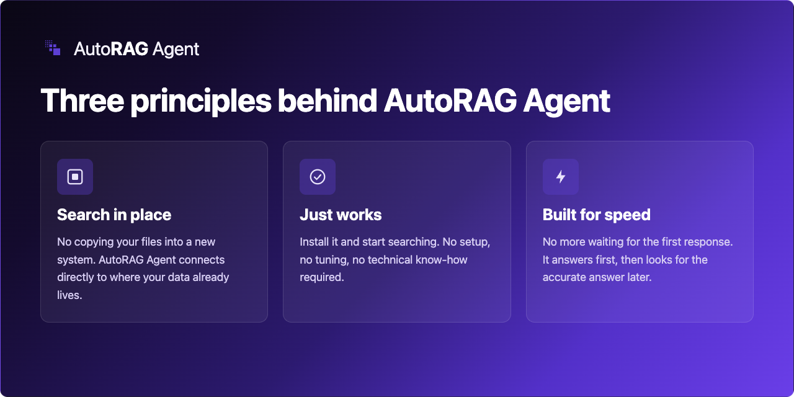

# AutoRAG Agent

**Now your agent can find anything in your computer.**

<p align="left">
  <a href="https://www.npmjs.com/package/@autorag/librarian"></a>
  <a href="https://www.npmjs.com/package/@autorag/librarian"></a>
  <a href="https://github.com/Marker-Inc-Korea/AutoRAG/stargazers"></a>
  <a href="https://github.com/Marker-Inc-Korea/AutoRAG/actions/workflows/ci.yml"></a>
  <a href="LICENSE"></a>
  = 24" />
  = 1.2" />
</p>

<p align="center">
  
</p>

> [!IMPORTANT]
> **Looking for the original AutoRAG (RAG AutoML / pipeline optimization tool)?**
> This repository now hosts **AutoRAG 2.0**, a complete reimagining of AutoRAG as a self-evolving librarian agent. The original Python-based AutoRAG — the RAG AutoML tool for automatically finding an optimal RAG pipeline for your data — now lives in the [`legacy/`](legacy/) directory of this repository.
>
> **The legacy AutoRAG is NOT abandoned.** It continues to be maintained (bug fixes, dependency updates, and PyPI releases via `pip install AutoRAG`) in maintenance mode. Existing users can keep using it exactly as before — see the [legacy README](legacy/README.md) for its documentation, and file issues in this repository as usual. New feature development is focused on AutoRAG Agent (2.0).

---

## What is AutoRAG Agent?

Search tools dump file paths and matching lines — forcing you to open files, read context, and synthesize answers yourself.

**AutoRAG Agent is a self-evolving librarian agent.** Built on the [Pi](https://github.com/earendil-works/pi-mono) agent framework, a single configured model searches across multiple retrieval methods, opens source documents directly via `bash` to verify ground truth, and curates answers into clean, numbered knowledge units:

```text
You ask:  "What changes were made to the cloud infrastructure contract in Q3?"

AutoRAG Agent:
[1] Enterprise Compute Discount — AWS annual discount tier increased to 28% based on commitment volume. (contracts/cloud-2026.pdf:p.4)
[2] Regional Data Residency — Explicit compliance clause pinning customer data storage to the Seoul AWS region. (/slack/legal-ops/chunks/318)
[3] SLA Guarantee — Guaranteed uptime threshold adjusted to 99.95% with penalty credits starting at 15 minutes downtime. (contracts/sla-addendum.md:lines 45-62)
```

---

## Core Values

<p align="center">
  
</p>

Three principles drive every design decision in AutoRAG Agent:

1. **Never migrate your data to search it.** Traditional RAG systems force you to upload, ETL, and duplicate your files into a centralized vector database. AutoRAG Agent federates your data **in place**, querying CLI-native stores (`lazykatok`, `discrawl`, `slacrawl`, `mailcrawl`, `rclone`, `qmd`) where your data already lives. Results retain opaque, source-native identities (`/kakao/...`, `/slack/...`) that preserve local access control and privacy. *(See our [Competitive Landscape Study](docs/competitive-landscape-2026-09.md) on why in-place federation is the durable differentiator).*

2. **Just works — no RAG degree required.** No pipeline tuning, no vector-DB maintenance, and no remote embedding keys required. AutoRAG Agent automatically manages [MinSync](docs/minsync-setup.md) for incremental Change Data Capture (CDC) chunking and provides a local [embedding gateway](docs/embedding-runtime.md) out of the box with zero external telemetry. A [remote rerank model](docs/rerank.md) (OpenRouter, `voyageai/rerank-3-lite` by default) is an opt-in extra.

3. **Fast by design.** Rather than coordinating slow multi-agent hierarchies, a single configured model owns the entire retrieval, direct-read, and curation loop. Local CDC chunks (BM25, vector, and hybrid modes) deliver rapid, low-latency turnaround across multi-turn research queries.

---

## Architecture & How It Works

AutoRAG Agent orchestrates five integrated subsystems:

1. **Self-Evolving Memory System (`check_memory`):** Before querying, the agent consults historical outcomes stored in `~/.autorag/memory.json` to prioritize retrieval methods that have proven successful for similar queries.
2. **Pluggable Multi-Method Retrieval:**
   - **BM25 Lexical Search:** Fast keyword ranking via MinSync over parsed markdown mirrors.
   - **Semantic Vector Search:** Dense vector retrieval over CDC chunks via the built-in embedding gateway.
   - **Hybrid Search:** Combines BM25 and vector ranking via Reciprocal Rank Fusion (RRF).
   - **Jikji Find-First Discovery:** Local CLI-backed fast discovery answer packs.
   - **Everything File-Name Search (Windows):** The bundled [voidtools Everything](https://www.voidtools.com/) indexes file and folder names under your search roots so the agent finds files by name, extension, path, size, or date instantly (`everything_search`).
   - **FSearch File-Name Search (macOS/Linux):** [fsearch-cli](https://github.com/NomaDamas/fsearch-mac) (FSearch) keeps a live, per-workspace name index of your search roots so the agent finds files by name, extension, path, size, or date instantly (`fsearch_search`); without fsearch-cli installed it degrades to a slow filesystem walk.
   - **Datasource Skills:** Federated retrieval across every configured external datasource.
3. **Result Merger & Scope Narrowing:** Cross-method deduplication, score normalization, and ordinary query-scope narrowing.
4. **Direct Evidence Reading (`bash`):** The agent directly opens and inspects promising files with `cat`, `grep`, or `find` to verify facts against ground truth.
5. **Curation & Active Feedback:** Structured findings are returned via `emit_autorag_results`. When callers provide feedback on which items were useful, AutoRAG records this to optimize future queries.

### Pi host boundary

AutoRAG uses `@earendil-works/pi-coding-agent` as the runtime host for model sessions. Pi owns provider credentials and OAuth storage, model-runtime dispatch, session JSONL persistence/resume, extension loading, lifecycle events, and the built-in `read`/`bash`/`edit`/`write`/`grep`/`find`/`ls` tools. AutoRAG registers only its domain tools and keeps orchestration outside the host: datasource orchestration, MinSync/Jikji preparation, memory hints, fast-to-verification two-phase search, structured result emission, and remote-session filtering.

The CLI TUI (`autorag tui`) is Pi's interactive mode hosted on the AutoRAG librarian: there is no separate AutoRAG renderer. Pi owns the terminal UI and its native in-session commands — `/login`/`/logout`, `/model`, `/resume`, `/new`, `/tree`, `/compact`, and `/settings` — so provider sign-in and model selection work on first launch even when no AutoRAG model is configured. AutoRAG registers its retrieval tools and streams progress, preliminary answers, and final results into the same Pi session, so resume and two-phase search keep working together.

Update notices are AutoRAG's, not Pi's: `autorag tui` suppresses Pi's "run `pi update`" banner (Pi is a bundled host, not a separate install) and instead checks the published `@autorag/librarian` release, showing a one-line notice in the session when a newer version exists. Set `AUTORAG_NO_UPDATE_CHECK=1` to skip the lookup; `AUTORAG_UPDATE_CHECK_URL` overrides the registry endpoint.


---

## 🤖 For AI Agents & LLMs: Setup & Skills

If you are an AI coding agent or LLM (Claude Code, Cursor, Windsurf, Codex, Senpi, Pi, etc.) tasked with installing, configuring, or querying AutoRAG Agent, use our built-in skills located in the [`skills/`](skills/) directory:

| Skill | Directory | When to Use |
|---|---|---|
| **`autorag`** | [`skills/autorag/`](skills/autorag/SKILL.md) | Model-backed querying, searching, comparing, and summarizing with an already configured AutoRAG librarian. |
| **`autorag-setup`** | [`skills/autorag-setup/`](skills/autorag-setup/SKILL.md) | Installing AutoRAG, configuring the model-backed librarian, adding roots/datasources, running health checks, and registering Lite MCP when needed. |
| **`autorag-lite-setup`** | [`skills/autorag-lite-setup/`](skills/autorag-lite-setup/SKILL.md) | Installing/registering `autorag-mcp`, initializing model-free config, maintaining indexes, and verifying MCP search. |

### Install the skills into your coding agent

Skills are not auto-discovered — copy only the setup skill when an agent needs
to bootstrap AutoRAG. **Routine AutoRAG Lite retrieval is provided by MCP
tools, not by a `autorag-lite-search` skill or shell command.**

```bash
# From a clone of this repository
mkdir -p .claude/skills
cp -R skills/autorag-lite-setup .claude/skills/
```

```bash
# From a global install — the npm package ships the same skills/ folder
AUTORAG_SKILLS="$(npm root -g)/@autorag/librarian/skills"
# Bun global installs live at ~/.bun/install/global/node_modules/@autorag/librarian/skills
mkdir -p .claude/skills
cp -R "$AUTORAG_SKILLS/autorag-lite-setup" .claude/skills/
```

Run the setup skill once to register the stdio server with the host. Reload the
agent, then discover the actual tool names and schemas with MCP `tools/list`.
The normal Lite path is `autorag.status` → `autorag.refresh` when needed →
`autorag.search`; use `autorag.report`, `autorag.evidence`, and
`autorag.feedback` for the optional curation lifecycle. Copy `skills/autorag`
and `skills/autorag-setup` only when the agent should also drive the
model-backed librarian, and `skills/autorag-doctor` for diagnostics. Other
agents read their own skill directories; copy the same setup folder there and
reload the agent session so it picks up the MCP registration instructions.
Do not copy or retain the removed `autorag-lite-search` skill.

### Quick Agent Workflow

1. **Install CLI:**
   ```bash
   command -v autorag >/dev/null || bun install -g @autorag/librarian
   ```
2. **Inspect & Preflight:**
   ```bash
   autorag status --json        # check corpus freshness and index readiness
   autorag duplicates --json    # scan for exact or near-duplicate document families
   ```
3. **Perform Curated Search:**
   ```bash
   autorag search "your question" --json
   ```
4. **Safety Guidelines for Agents:**
   - **Never delete, move, or modify original user documents.**
   - AutoRAG writes index artifacts strictly into `<workspace>/.autorag/` and `.jikji/` caches.
   - Never print or leak API keys, tokens, or credential values into stdout or logs.

---

## AutoRAG Lite MCP Server

Register the package's stdio server with the host; the host owns the process
lifecycle and sends MCP tool calls:

```bash
AUTORAG_CONFIG=/absolute/path/to/.autorag/config.json autorag-mcp
```

For Claude Code and Codex registration commands, use
[`skills/autorag-lite-setup/SKILL.md`](skills/autorag-lite-setup/SKILL.md).
The MCP contract source of truth is [`src/mcp/server.ts`](src/mcp/server.ts)
(tool registration, schemas, handlers) plus [`src/mcp/index.ts`](src/mcp/index.ts)
(stdio entrypoint). Discover tools and schemas with MCP `tools/list`; do not
hard-code a tool count.

Core Lite tools include `autorag.status`, `autorag.search`,
`autorag.search.files`, `autorag.datasources.list`, `autorag.datasources.get`,
`autorag.refresh`, `autorag.report`, `autorag.evidence`, and
`autorag.feedback`. Configured integrated datasources expose additional scoped
search tools. Read-only MCP mode omits mutating tools such as refresh, report,
and feedback.

## ⚡ AutoRAG Lite: Model-Free Retrieval Engine

Need blazing fast local search without configuring an LLM or paying for API tokens? Use **AutoRAG Lite**.

AutoRAG Lite provides the exact same high-performance indexing, BM25 ranking, and local MinSync vector/hybrid retrieval engine as the full librarian, but **runs 100% model-free**:

- **Zero LLM Token Usage:** Run purely local BM25 and vector search offline.
- **Agent Integration Ready:** Use the AutoRAG Lite MCP server to supply raw context chunks to an external model; the CLI remains a bootstrap and maintenance interface.
- **Fast Local CLI:** The CLI remains available for terminal-only indexing and repair.

```bash
# Initialize a model-free workspace
autorag lite init --search-paths ./documents

# Index local files and datasources
autorag lite refresh
```

Normal Lite retrieval runs through the MCP tools (`autorag.status`,
`autorag.search`); the CLI remains the bootstrap and maintenance interface for
indexing and repair.

---

## 🔌 Supported Datasources

AutoRAG Agent connects to external tools and communication platforms using dedicated datasource skills. Data remains in each tool's native store — AutoRAG does not copy or ingest foreign databases into a centralized store:

| Datasource | Skill Alias | Backend / Driver | Storage & Privacy Model | Search Capabilities |
|---|---|---|---|---|
| **Local Documents** | `local` | Native filesystem & MinSync | Workspace-local parsed mirrors (`.autorag/`) | BM25, Semantic, Hybrid |
| **KakaoTalk** | `kakao` | [`lazykatok`](https://github.com/changeroa/lazykatok) CLI | Native KakaoTalk archive; zero direct DB access | BM25, Semantic, Hybrid |
| **Discord** | `discord` | [`discrawl`](https://github.com/openclaw/discrawl) CLI | Native SQLite archive; token-free wiretap mode | BM25, Semantic, Hybrid |
| **WhatsApp** | `whatsapp` | [`wacrawl`](https://github.com/openclaw/wacrawl) CLI | Local-first incremental archive + FTS5 | Lexical FTS5 |
| **Telegram** | `telegram` | [`telecrawl`](https://github.com/openclaw/telecrawl) CLI | Local-first desktop archive + FTS5 | Lexical FTS5 |
| **Slack** | `slack` | [`slacrawl`](https://github.com/openclaw/slacrawl) CLI | Local workspace/channel/thread archive + FTS5 | Lexical FTS5 |
| **Notion** | `notion` | [`notcrawl`](https://github.com/openclaw/notcrawl) CLI | Local page/database/block archive + FTS5 | Lexical FTS5 |
| **Email Archives** | `mailcrawl` | [`mailcrawl`](https://github.com/NomaDamas/mailcrawl) CLI | Local Gmail, IMAP, and Maildir storage | BM25, Semantic, Hybrid |
| **Local Mail Export**| `mail-export` | Built-in `.mbox` / `.eml` parser | Local filesystem mailboxes | Lexical |
| **Obsidian Vaults** | `obsidian` | [`qmd`](https://github.com/tobi/qmd) CLI | Direct markdown vault indexing | BM25, Semantic |
| **GitHub** | `github` | GitHub REST API | In-memory fetched Issues and Pull Requests | Lexical, Scoped |
| **GitHub Gists** | `github-gist` | GitHub REST API | Incremental local index of own-account public and permitted secret Gist content/metadata; token not stored | Lexical (BM25), Local Semantic, Scoped |
| **Cloud Drives** | `cloud-drive` | [`rclone`](https://rclone.org) CLI | Google Drive (Tier-1), OneDrive, Dropbox, etc. | Incremental Mirror + BM25 |
| **Photos & Shots** | `clawgallery` | `clawgallery` CLI | Local screenshot and photo store | Hybrid OCR/Visual Search |
| **RSS / News** | `rss` | Native HTTP Poller | RSS 2.0 & Atom feeds (24h deduplication) | Lexical |
| **macOS Spotlight** | `spotlight` | Native `mdfind` CLI | macOS system metadata and content index | System Native |

For configuration syntax and connector details, see [docs/datasource-skills.md](docs/datasource-skills.md). Non-interactive `sync`/`index` steps get a 30-minute per-connector budget (`connector.indexTimeoutMs`) because first-run imports routinely take minutes; interactive search keeps its 60-second default.

---

## Installation & Setup

AutoRAG Agent is published as `@autorag/librarian` (requires Node.js ≥ 24 or Bun):

```bash
# Install CLI globally
bun install -g @autorag/librarian
# or with npm:
npm install -g @autorag/librarian

# Add as a TypeScript/JavaScript library
bun add @autorag/librarian
```

### System Prerequisites

- **No Java required:** Document parsing (HWP/HWPX/HWPML, PDF, DOCX, XLSX/XLS) runs in-process through [`kordoc`](https://github.com/chrisryugj/kordoc).
- **Rust Toolchain (Optional):** Automatically compiles Jikji (`jikji-cli`) if installed.
- **MinSync:** Automatically downloaded and installed into `<workspace>/.autorag/bin` on first run.
- **Everything (Windows only, bundled):** The package ships the portable Everything 1.4.1.1032 and its ES 1.1.0.38 CLI (x64 and ARM64, SHA-256 pinned). On Windows, AutoRAG extracts them into `<workspace>/.autorag/everything/` and runs a private, user-level instance that indexes only your configured search roots: no administrator rights, no Everything service, no whole-drive scan, no HTTP/ETP server, and no change to any Everything you already run. Set `"everything": false` in the config to turn it off. macOS and Linux are not affected.
- **FSearch (macOS/Linux only, separate install):** Install [`fsearch-cli`](https://github.com/NomaDamas/fsearch-mac) yourself (e.g. `brew install NomaDamas/fsearch-mac/fsearch-mac` (installs the `fsearch-cli` binary); GPL-2.0, spawned as a separate process, never bundled or linked). On macOS and Linux, AutoRAG builds a per-workspace database at `<workspace>/.autorag/fsearch/` indexing only your configured search roots, and keeps a `fsearch-cli watch` daemon live (FSEvents/inotify) for sub-second name search. It never touches the FSearch app's own database. Without fsearch-cli, name search falls back to a slow bounded filesystem walk. Set `"fsearch": false` in the config to turn it off. Windows is not affected (Everything covers it).

---

## Quick Start

### 1. Initialize and Index

```bash
# Initialize configuration for your documents folder
autorag init --search-paths ~/Documents/research

# Korean + English is the default; set it explicitly for other corpora
autorag init --search-paths ~/Documents/research --languages ja,en

# Index documents (parses PDFs/Markdown, builds BM25 and MinSync vectors)
autorag refresh

# Check indexing health
autorag status
```

### Document languages and parsers

One global `languages` setting describes the corpus. It is resolved from
`--languages`, then `AUTORAG_LANGUAGES`, then `languages` in the config file,
falling back to `["ko", "en"]`. Supported tags: `ko`, `en`, `ja`, `zh-hans`,
`zh-hant`, `fr`, `de`, `es`, `ru`, `it`, `pt`, `vi`, `th`, `ar`, `hi`.

| Extension | Parser |
|---|---|
| `.hwp` `.hwpx` `.hml` `.hwpml` `.pdf` `.docx` `.xlsx` `.xls` | `kordoc` (nested tables, per-sheet workbooks, no Java) |
| `.pptx` | built-in PPTX reader |
| `.eml` | built-in mail reader |
| `.txt` `.text` `.md` `.markdown` | plain text (CP949/EUC-KR aware) |
| `.png` `.jpg` `.jpeg` `.bmp` `.tiff` `.webp` | image OCR (opt-in) |

OCR is opt-in and never runs unless enabled, so indexing downloads no model by
default. When enabled, `languages` selects the recognition languages
(`ja` → `jpn`, `zh-hans` → `chi_sim`, …) for both standalone images and scanned
PDF pages.

### 2. Search from CLI

```bash
# Perform a curated search (uses your configured reasoning model)
autorag search "What are our primary Q3 deliverables?"

# Launch the interactive Terminal UI (Pi host: /login, /model, /resume, …)
autorag tui
```

### 3. Programmatic Usage (TypeScript API)

```typescript
import { AutoRAGAgent } from "@autorag/librarian";

// Initialize librarian agent
const agent = new AutoRAGAgent({
  searchPaths: ["/path/to/documents"],
});

// Run curated search loop
const response = await agent.searchDocuments("Summarize recent compliance updates");

console.log("Answer:", response.answer);
for (const result of response.results) {
  console.log(`[${result.number}] ${result.title} (${result.source})`);
  console.log(`    ${result.summary}`);
}

// Record feedback: Result [1] was useful, [2] was not
agent.recordFeedbackByNumbers(response.sessionId, [1], [2]);
```

---

## CLI Command Reference

| Command | Description |
|---|---|
| `autorag init` | Initialize `~/.autorag/config.json` with search roots, document languages, and model settings |
| `autorag refresh` | Refresh parsed mirrors, MinSync CDC chunks, datasources, Jikji, and the platform file-name index (Everything on Windows, FSearch on macOS/Linux) |
| `autorag search "<query>"` | Run the librarian agent to curate structured answers |
| `autorag status` | Inspect corpus freshness, indexing status, and vector readiness |
| `autorag health` | Check model provider authentication, token validity, and API reachability |
| `autorag models list` | List chat models the pi runtime can resolve (built-ins, `models.json`, custom/extension providers) with provider auth status; never prints credential values |
| `autorag update-check` | Compare the running `autorag` against the published npm version (also runs on `autorag tui` launch) |
| `autorag tui` | Open Pi's interactive librarian TUI (`/login`, `/model`, `/resume`, …) |
| `autorag duplicates [DIR]` | Read-only scan for exact and near-duplicate document families with `dupey` |
| `autorag lite ...` | CLI bootstrap, indexing repair, terminal maintenance, and fallback interface; agents use MCP for normal Lite operation |
| `autorag feedback <session>` | Record numbered feedback; MCP clients normally use `autorag.feedback`, and the CLI stays available for terminal maintenance |
| `autorag evidence <session>` | Inspect persisted evidence behind numbered results; MCP clients normally use `autorag.evidence`, and the CLI stays available for terminal maintenance |
| `autorag serve` | Start the P2P query server over SimpleX (opt-in) |
| `autorag p2p ...` | Manage peer trust, query approvals, and sharing policies |

---

## Documentation Links

Deep dive into AutoRAG Agent's architecture, security, and integration guides:

- **[MinSync Setup & Embedding QA](docs/minsync-setup.md):** Automatic binary installation, CDC chunking, and EmbeddingGemma verification.
- **[Local Embedding Runtime & Gateway](docs/embedding-runtime.md):** AutoRAG-owned local gateway, model prefetching, and zero-egress semantic search. Model cards: [`qwen3-embedding-0.6b`](docs/model-cards/qwen3-embedding-0.6b.md), [`embeddinggemma-300m`](docs/model-cards/embeddinggemma-300m.md).
- **[Datasource Skills Reference](docs/datasource-skills.md):** Full configuration contracts, connection aliases, and connector options.
- **[Jev Decisions](docs/jev-decisions.md):** Jev query pipeline, **on by default** via OpenRouter: it routes each question to a direct answer (intrinsic knowledge) or local search (everything needing more information; web search is left to the agent after the fast answer), splits multi-part questions into up to five parallel searches (`openrouter/qwen/qwen3.7-flash`), picks which registered datasources to search before the fast answer, and ends the run after the fast answer when that answer is complete. Also covers the `jev` judgment tool, backends (OpenRouter, TypeSafe, Vercel AI Gateway), and how to opt out.
- **[Manual QA & Datasource Test Harnesses](docs/manual-qa-datasources.md):** Real-world testing guides for Discord, KakaoTalk, Slack, Notion, and email.
- **[P2P SimpleX Sharing & Path Standard](docs/p2p-path-standard.md):** Decentralized peer query sharing with SimpleX, PII redaction, and approval queues.
- **[Supply Chain Security & License Audits](docs/supply-chain.md):** Software bill of materials (SBOM) and dependency gate policies.
- **[Competitive Landscape Study](docs/competitive-landscape-2026-09.md):** In-depth analysis of why in-place federation outperforms centralized RAG.
- **[Legacy AutoRAG (AutoML)](legacy/README.md):** Documentation for the legacy Python AutoML pipeline optimizer (`pip install AutoRAG`).

---

## Contributors & Community

AutoRAG Agent is an open-source project built by the community. We welcome contributions, bug reports, datasource connectors, and ideas!

- **Contributing:** Feel free to open an issue or pull request. Start with [CONTRIBUTING.md](CONTRIBUTING.md) — development setup, the `make ci` check we ask for, the `Signed-off-by` trailer every commit needs, and when to run the live end-to-end lanes. [MAINTAINERS](MAINTAINERS) lists who reviews which area. AI tools are allowed; unverified dumps are not — see [AI_POLICY.md](AI_POLICY.md).
- **Security:** Private vulnerability reports and the response SLA live in [SECURITY.md](SECURITY.md).
- **GitHub Contributors:** [View all contributors](https://github.com/Marker-Inc-Korea/AutoRAG/graphs/contributors) on GitHub.

---

## Acknowledgements

AutoRAG Agent stands on the shoulders of fantastic open-source projects:

- **[Pi Framework](https://github.com/earendil-works/pi-mono)** by [@earendil-works](https://github.com/earendil-works) — The foundational agent framework powering AutoRAG's reasoning loop.
- **[MinSync](https://github.com/Marker-Inc-Korea/minsync)** — Ultra-fast incremental Change Data Capture (CDC) chunking and local BM25/vector indexing.
- **[Jikji](https://github.com/NomaDamas/jikji)** by [NomaDamas](https://github.com/NomaDamas) — High-performance find-first local document discovery.
- **[Everything](https://www.voidtools.com/)** and **[ES](https://github.com/voidtools/ES)** by voidtools (David Carpenter) — Instant Windows file-name indexing and its command-line interface, bundled under the MIT License.
- **[FSearch](https://github.com/cboxdoerfer/fsearch)** and **[fsearch-cli](https://github.com/NomaDamas/fsearch-mac)** — Everything-style file-name search for macOS/Linux (GPL-2.0-or-later). Never bundled or linked: users install fsearch-cli separately and AutoRAG spawns it as a separate process (mere aggregation per the FSF GPL FAQ).
- **[dupey](https://github.com/NomaDamas/dupey)** by [NomaDamas](https://github.com/NomaDamas) — Fast duplicate and near-duplicate document family detection.
- **Federated CLI Authors:** External datasource tools [`lazykatok`](https://github.com/changeroa/lazykatok), [`discrawl`](https://github.com/openclaw/discrawl), [`mailcrawl`](https://github.com/NomaDamas/mailcrawl), [`wacrawl`](https://github.com/openclaw/wacrawl), [`telecrawl`](https://github.com/openclaw/telecrawl), [`slacrawl`](https://github.com/openclaw/slacrawl), [`notcrawl`](https://github.com/openclaw/notcrawl), [`qmd`](https://github.com/tobi/qmd), and [`rclone`](https://rclone.org).
- **[kordoc](https://github.com/chrisryugj/kordoc)** by [chrisryugj](https://github.com/chrisryugj) — HWP/HWPX/HWPML, PDF, DOCX and XLSX parsing with nested-table fidelity, used as AutoRAG's default document parser.

---

## Troubleshooting

When search returns nothing, a datasource disappears from results, refresh hangs, or the gateway will not start, run the **`autorag-doctor`** agent skill (`skills/autorag-doctor/SKILL.md`). Point your coding agent at it and say *"check AutoRAG"* — it walks the full diagnose-and-repair procedure and ends with a per-datasource status table showing what is indexed and what actually returns hits.

The first three commands cover most of it:

```bash
autorag status --json          # freshness, per-component state, diagnostics
autorag health --json          # model resolution + one live completion probe
autorag gateway status --format json   # on-demand embedding runtime
```

Indexing is not the same thing as searchability, so always confirm retrieval
itself through the connected Lite MCP server:

```text
autorag.status {}
autorag.refresh {}
autorag.search {"query":"a word that certainly appears","topK":3}
autorag.search {"query":"recent topic","scope":"/discord/local/**","topK":3}
```

The CLI equivalents remain available for terminal repair, but do not use them
as the agent's normal Lite search path.

Common failures and their fix:

| Symptom | Diagnostic code | Fix |
|---|---|---|
| Results are missing recent files | `stale-index` | `autorag refresh --method parsed,minsync --json` |
| Semantic search returns nothing after changing the embedder | `embedding-identity-mismatch` | `autorag index rebuild --method minsync` |
| Gateway will not start, a previous run was killed | `lock-conflict` | `autorag gateway stop`, then retry |
| A datasource is healthy in its own CLI but absent from results | — | confirm it is configured under `datasources` and connected through its native CLI |
| A datasource errors during refresh | `datasource-index-failed` | run that CLI's own `doctor` |
| MinSync or Jikji missing | `minsync-unavailable`, `jikji-unavailable` | check the Rust toolchain, re-run refresh |
| Windows file-name search fails during refresh | `everything-index-failed` | read the ES exit code and stderr in the message, then `autorag refresh --method everything --json` |
| Every search does a full local search and verification, even for small talk | `query-route-fallback` | set `OPENROUTER_API_KEY` (Jev routing and decomposition are on by default) |

Native datasource stores stay owned by their CLIs — AutoRAG never rebuilds them. Fix a broken archive with `lazykatok doctor`, `discrawl --json metadata`, `slacrawl --json doctor`, `wacrawl --json doctor`, `telecrawl --json doctor`, `notcrawl doctor`, `qmd status`, or `mailcrawl doctor`, then re-run `autorag refresh --method datasources --json`.

## License

- **AutoRAG 2.0 (AutoRAG Agent):** Released under the [MIT License](LICENSE).
- **Legacy Python AutoRAG (`legacy/`):** Released under the [Apache License 2.0](legacy/LICENSE).
- Production third-party notices and licenses are documented in [`NOTICE`](NOTICE).
- The bundled Windows binaries keep their own licenses: Everything (MIT, plus PCRE BSD-3-Clause) in [`licenses/everything-MIT-and-PCRE-BSD.txt`](licenses/everything-MIT-and-PCRE-BSD.txt) and ES (MIT) in [`licenses/es-MIT.txt`](licenses/es-MIT.txt). Everything's source code is not public; AutoRAG redistributes the unmodified voidtools portable ZIPs.
- FSearch/fsearch-cli (GPL-2.0-or-later) are **not** distributed with AutoRAG: no code is copied, linked, or bundled. Users install fsearch-cli themselves and AutoRAG communicates with it only through its command-line interface and daemon socket — separate programs, per the [FSF mere-aggregation FAQ](https://www.gnu.org/licenses/gpl-faq.html#MereAggregation). Source: https://github.com/NomaDamas/fsearch-mac.
