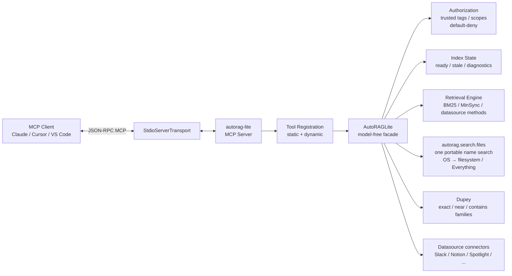
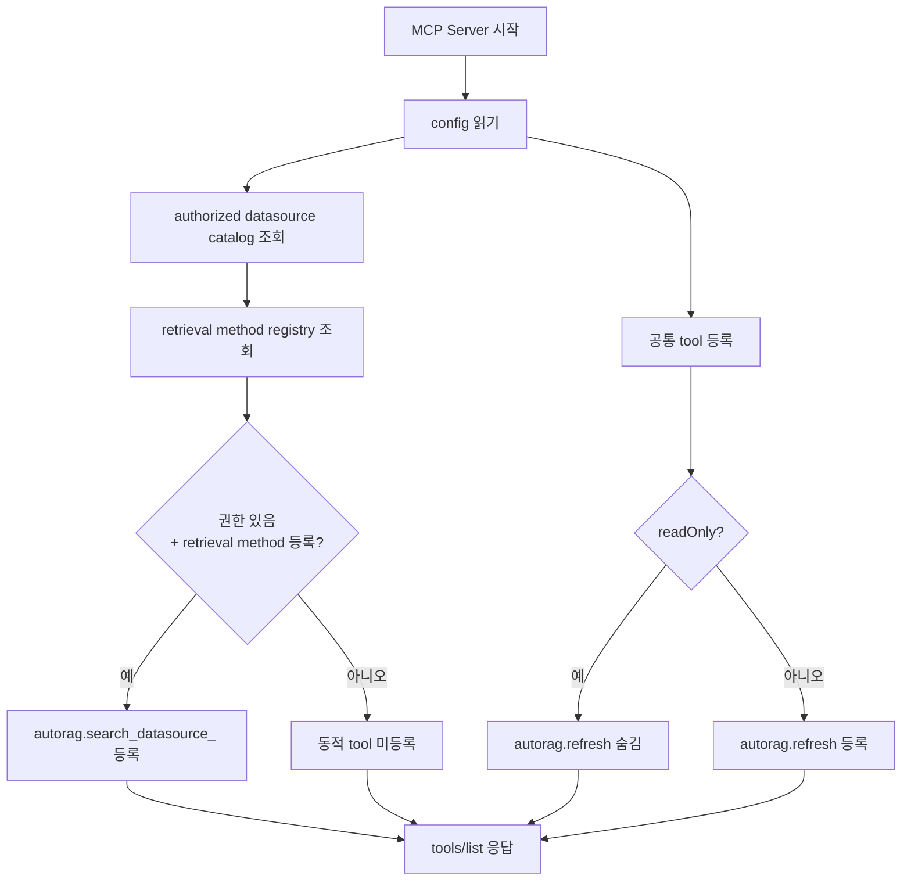
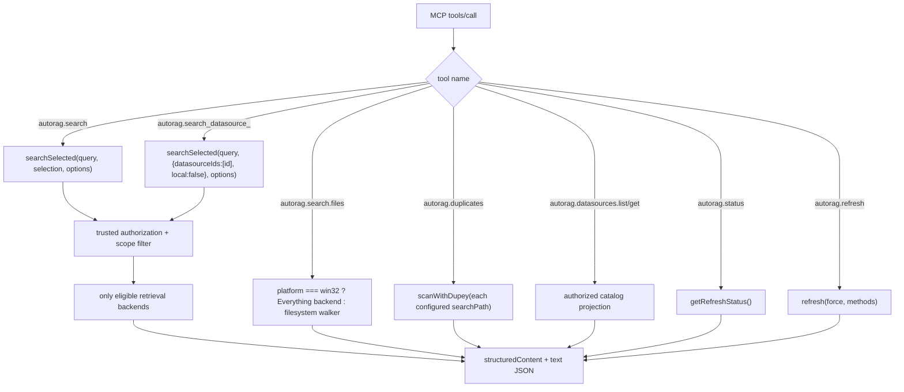
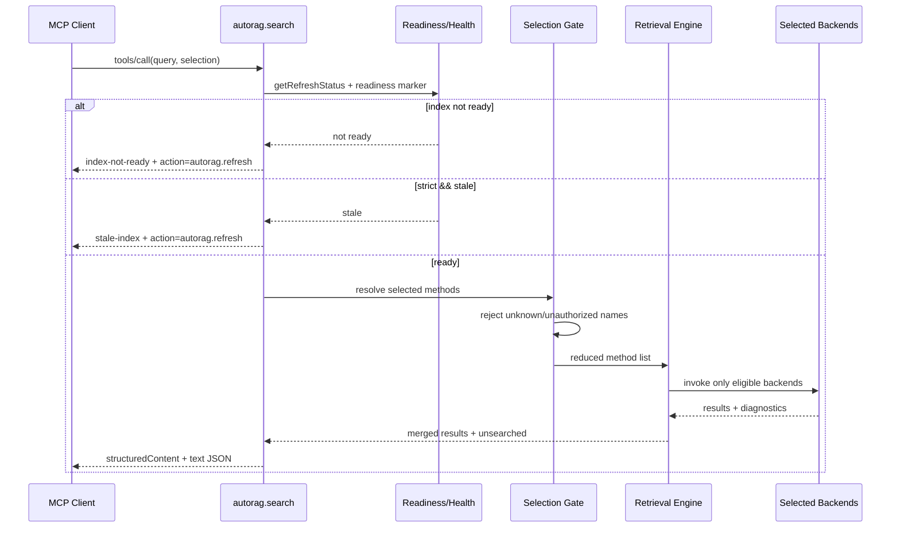
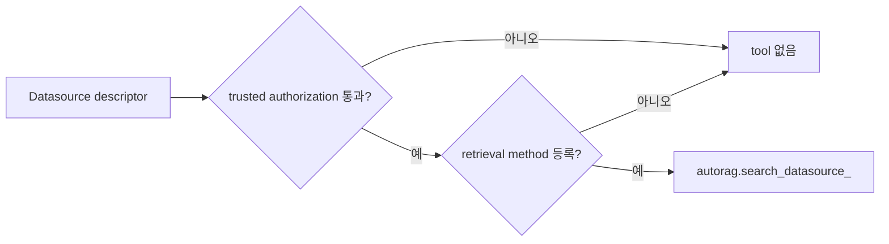
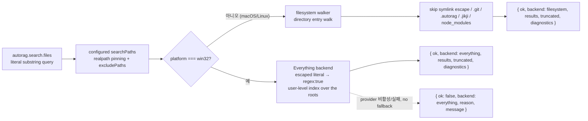
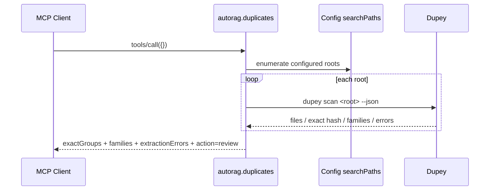

# AutoRAG Lite MCP Contract — 한눈에 보기

이 문서는 현재 `src/mcp/server.ts`와 `src/mcp/index.ts` 구현을 기준으로 작성한 MCP 계약 요약입니다.

- 전송: local stdio
- 서버 이름: `autorag-lite`
- 서버 실행: `autorag-mcp`
- 기본 workspace/config: `AUTORAG_CONFIG`
- refresh를 숨기는 모드: `AUTORAG_MCP_READ_ONLY=true`
- tool allowlist: `AUTORAG_MCP_TOOLS=...`

---

## 1. 전체 구조



### 핵심 원칙

1. MCP tool은 답변을 생성하지 않습니다. 검색 결과와 진단을 외부 모델에 전달합니다.
2. datasource 권한은 config의 trusted allow-tags/scopes에서만 결정됩니다.
3. tool argument는 권한을 넓힐 수 없습니다.
4. 선택 검색은 backend 실행 전에 대상 method를 줄입니다.
5. refresh 외 모든 현재 MCP tool은 read-only입니다.
6. 원본 문서는 이동·삭제하지 않습니다.

---

## 2. tools/list에 나타나는 tool



### 항상 후보인 공통 tool

| Tool | 역할 | 입력 | 쓰기 |
|---|---|---|---|
| `autorag.status` | index freshness/health 조회 | `{}` | 아니오 |
| `autorag.search` | 여러 retrieval surface 선택 검색 | `query`, `topK`, `scope`, `tags`, `strict`, `datasourceIds`, `methods`, `local` | 아니오 |
| `autorag.search.files` | 파일/폴더 이름 검색 (OS 자동: Windows Everything, 그 외 filesystem walker) | `query`, `root`, `matchPath`, `matchCase`, `kind`, pagination | 아니오 |
| `autorag.datasources.list` | authorized datasource 목록 | `{}` | 아니오 |
| `autorag.datasources.get` | datasource 하나 조회 | `{ datasourceId }` | 아니오 |
| `autorag.duplicates` | Dupey 중복/문서 family 스캔 | `{}` | 아니오 |
| `autorag.refresh` | parsed/index refresh | `force`, `methods` | **예** |

### 동적 datasource tool

예를 들어 현재 config와 registry가 다음을 허용하면:

```text
Slack  → retrieval method 등록됨
Notion → retrieval method 등록됨
Empty  → catalog에는 있지만 retrieval method 없음
Denied → config authorization에서 거부
```

tools/list에는 다음처럼 나타납니다.

```text
autorag.search_datasource_slack
autorag.search_datasource_notion
```

`Empty`와 `Denied`는 전용 tool이 생기지 않습니다.

---

## 3. tool 호출 라우팅



---

## 4. 일반 검색 contract

### 호출

```json
{
  "name": "autorag.search",
  "arguments": {
    "query": "refund approval policy",
    "topK": 5,
    "datasourceIds": ["slack"],
    "methods": ["slack.keyword"],
    "local": false,
    "scope": "/slack/workspace",
    "tags": ["slack"],
    "strict": true
  }
}
```

### 실행 순서



### 선택 semantics

| 입력 | 실행 대상 |
|---|---|
| `datasourceIds` 생략 | authorized datasource methods + local methods |
| `datasourceIds: ["slack"]` | Slack methods만 |
| `datasourceIds: ["slack"], local: true` | Slack methods + local methods |
| `local: false` | local methods 제외 |
| `methods` 지정 | 현재 eligible set과 교집합 |
| unknown method/datasource | 실행 전 오류 |
| unauthorized method/datasource | 실행 전 오류, backend 미실행 |

`tags`, `scope`, `allowedScopes`는 trusted policy를 좁힐 수만 있고 넓힐 수 없습니다.

---

## 5. 동적 datasource 검색 contract

### 호출

```json
{
  "name": "autorag.search_datasource_slack",
  "arguments": {
    "query": "incident response",
    "topK": 5,
    "scope": "/slack/workspace"
  }
}
```

### 고정되는 값

```ts
selection = {
  datasourceIds: ["slack"],
  local: false,
};
```

사용자는 datasource id나 method를 입력하지 않습니다. 서버가 이미 authorization과 연결 상태를 확인했기 때문입니다.

### 동적 tool이 생기는 조건



---

## 6. datasource catalog contract

### 목록 조회

```json
{
  "name": "autorag.datasources.list",
  "arguments": {}
}
```

```json
{
  "ok": true,
  "datasources": [
    {
      "datasourceId": "slack",
      "name": "Slack",
      "type": "chat",
      "description": "Slack workspace messages",
      "tags": ["slack"],
      "capabilities": ["keyword", "scoped"],
      "status": "active",
      "sourceScopes": ["/slack/workspace"]
    }
  ]
}
```

공개되는 정보:

- identity
- description
- capability
- status
- authorized source scope

공개하지 않는 정보:

- API key
- access token
- credential value
- config file path
- raw private instance metadata

---

## 7. 파일명 검색과 Dupey

### 파일명 검색



- `backend` discriminator가 `"filesystem"`과 `"everything"`을 구분합니다.
- `query`는 정규식이 아니라 literal substring입니다. Windows에서는 escape한 뒤 Everything regex(`regex: true`)로 전달합니다.
- Windows provider가 실패/비활성이면 filesystem walker로 조용히 대체하지 않고 `isError: true`의 구조화된 실패를 반환합니다.
- `root`는 configured search root 내부로만 제한되고 `excludePaths`가 존중됩니다.
- `maxResults`/`offset` 페이지는 권한 필터링 이후에 적용되며 lookahead로 `truncated`를 판정합니다.
- parsed mirror refresh가 없어도 동작합니다. 파일 내용은 읽지 않습니다.

### Dupey 중복 스캔



반환되는 `action: "review"`는 자동 삭제나 이동을 의미하지 않습니다. Dupey의 `near`, `contains`, `pick` 정보는 사람이 검토할 후보와 근거입니다.

---

## 8. 공통 오류 contract

실행 오류는 다음 형태입니다.

```json
{
  "isError": true,
  "structuredContent": {
    "ok": false,
    "errorCode": "index-not-ready",
    "message": "...",
    "action": "autorag.refresh"
  }
}
```

| errorCode | 의미 | 다음 행동 |
|---|---|---|
| `index-not-ready` | parsed/index readiness marker 없음 | `autorag.refresh` |
| `stale-index` | `strict: true`인데 index stale | `autorag.refresh` |
| `invalid-selection` | method/datasource 선택이 unknown 또는 unauthorized | 입력 수정 |
| `search-failed` | retrieval 실행 실패 | diagnostic 확인 후 재시도 |
| `duplicates-disabled` | Dupey가 config에서 비활성화 | config 확인 |
| `duplicates-failed` | Dupey 미설치/timeout/invalid JSON 등 | Dupey 설치·config 확인 |
| `datasource-not-found` | authorized catalog에 없음 | `datasources.list` 재확인 |
| `refresh-failed` | refresh 실패 | diagnostic 확인 후 재시도 |

`autorag.search.files`의 Windows Everything backend는 실패 시 자체 union을 반환하며, filesystem backend로 자동 대체하지 않습니다.

```json
{
  "ok": false,
  "backend": "everything",
  "reason": "unsupported-platform",
  "message": "Everything is not enabled on this host."
}
```

---

## 9. 운영자가 기억할 5개 호출

```text
1. autorag.status
   → 지금 index가 준비됐나?

2. autorag.refresh
   → 준비되지 않았거나 stale이면 갱신

3. autorag.datasources.list
   → 어떤 datasource가 권한 있고 연결됐나?

4. autorag.search_datasource_slack
   → Slack만 검색

5. autorag.duplicates
   → 중복/family를 검토용으로 확인
```

### 실제 MCP client 설정

```json
{
  "mcpServers": {
    "autorag": {
      "command": "autorag-mcp",
      "env": {
        "AUTORAG_CONFIG": "/absolute/path/to/.autorag/config.json"
      }
    }
  }
}
```

동적 datasource tool은 서버 시작 시 생성되므로 datasource config를 변경했으면 MCP 프로세스를 재시작해야 합니다.
