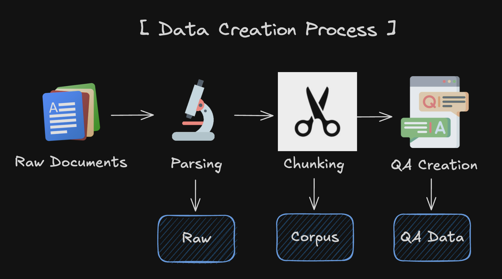
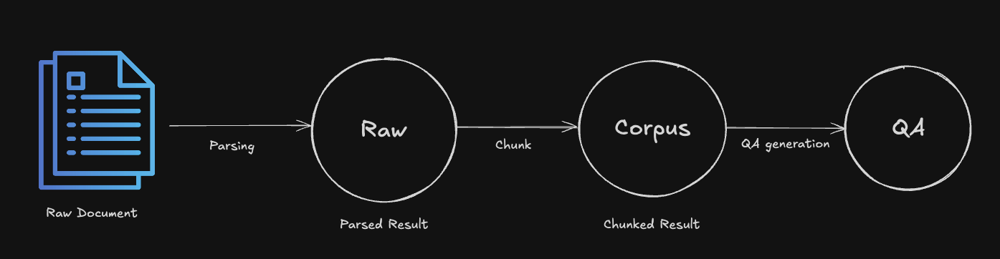

# Data Creation

Data creation is the crucial process to use AutoRAG. Because AutoRAG needs an evaluation dataset for optimizing the RAG pipelines.
The following guide covers how to use LLM to create data in a form that AutoRAG can use.

## Basic Concepts



In this new data creation pipeline, we have three schemas. `Raw`, `QA`, and `Corpus`.

- `Raw`: Raw data after you parsed your documents. You can use this data to create `Corpus` data.
- `QA`: Question and Answer pairs. The main part of the dataset. You have to write a great question and answer pair for evaluating the RAG pipeline accurately.
- `Corpus`: The corpus is the text data that the LLM will use to generate the answer.
You can use the corpus to generate the answer for the question.
You have to make corpus data from your documents using parsing and chunking.

In other words,
`Raw` : parsed data
`Corpus` : chunked data
`QA` : Question & Answer dataset based on the corpus



To see the tutorial of the data creation, check [here](tutorial.md).

```{toctree}
---
maxdepth: 1
---
qa_creation/qa_creation.md
chunk/chunk.md
parse/parse.md
legacy/legacy.md
```
