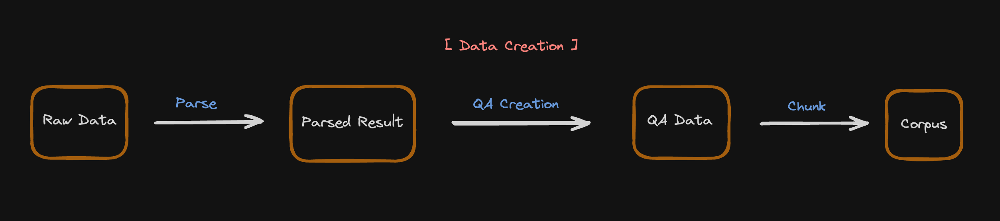

# Start creating your own evaluation data

## Index

1. [Overview](#overview)
2. [Raw data to Corpus data](#make-corpus-data-from-raw-documents)
3. [Corpus data to QA data](#make-qa-data-from-corpus-data)
4. [Use custom prompt](#use-custom-prompt)
5. [Use multiple prompts](#use-multiple-prompts)


## Overview
For the evaluation of RAGs we need data, but in most cases we have little or no satisfactory data.

However, since the advent of LLM, creating synthetic data has become one of the good solutions to this problem.

The following guide covers how to use LLM to create data in a form that AutoRAG can use.

---


AutoRAG aims to work with Python’s ‘primitive data types’ for scalability and convenience.

Therefore, to use AutoRAG, you need to convert your raw data into `corpus data`  and `qa data` to our [data format](./data_format.md).


## Make corpus data from raw documents
1. Load your raw data to texts with loaders such as lama_index, LangChain, etc.
2. Chunk the texts into passages. Use Langchain, LlamaIndex, etc.
3. Make it into corpus data to use converter functions.
   There are converter functions for llama index `Document`, `TextNode`, and Langchain `Document` objects,
   which is `llama_document_to_parquet`, `llama_text_node_to_parquet`, and `langchain_document_to_parquet`.

- Use Llama Index

```python
from llama_index.core import SimpleDirectoryReader
from llama_index.core.node_parser import TokenTextSplitter
from autorag.data.corpus import llama_text_node_to_parquet

documents = SimpleDirectoryReader('your_dir_path').load_data()
nodes = TokenTextSplitter().get_nodes_from_documents(documents=documents, chunk_size=512, chunk_overlap=128)
corpus_df = llama_text_node_to_parquet(nodes, 'path/to/corpus.parquet')
```

- Use LangChain

```python
from langchain_community.document_loaders import DirectoryLoader
from langchain_text_splitters import RecursiveCharacterTextSplitter
from autorag.data.corpus import langchain_documents_to_parquet

documents = DirectoryLoader('your_dir_path', glob='**/*.md').load_data()
documents = RecursiveCharacterTextSplitter(chunk_size=512, chunk_overlap=128).split_documents(documents)
corpus_df = langchain_documents_to_parquet(documents, 'path/to/corpus.parquet')
```

```{tip}
The format for corpus data can be found [corpus data format](data_format.md#corpus-dataset)
```

## Make qa data from corpus data

```{tip}
The format for qa data can be found [qa data format](data_format.md#qa-dataset)
```

```python
import pandas as pd
from llama_index.llms.openai import OpenAI
from autorag.data.qacreation import generate_qa_llama_index, make_single_content_qa

corpus_df = pd.read_parquet('path/to/corpus.parquet')
llm = OpenAI(model='gpt-3.5-turbo', temperature=1.0)
qa_df = make_single_content_qa(corpus_df, 50, generate_qa_llama_index, llm=llm, question_num_per_content=1,
                               output_filepath='path/to/qa.parquet')
```

`generate_qa_llama_index` is a function designed to generate **questions** and its **generation_gt** per content.
You can set the number of questions per content by changing `question_num_per_content` parameter.

And the `make_single_content_qa` function is designed to generate `qa.parquet` file using input function.
It generates 'single content' qa data, also known as 'single-hop' or 'single-document' QA data.
Which means it uses only one passage per question for answering the question.

```{admonition} What is passage?
Passage is chunked units from raw data.
```

## Use custom prompt

You can use custom prompt to generate qa data.
The prompt must contains two placeholders:

- {{text}}: The content string
- {{num_questions}}: The number of questions to generate

```python
import pandas as pd

from llama_index.llms.openai import OpenAI
from autorag.data.qacreation import generate_qa_llama_index, make_single_content_qa

prompt = """
Generate question and answer pairs for the given passage.

Passage:
{{text}}

Number of questions to generate: {{num_questions}}

Example:
[Q]: What is this?
[A]: This is a sample question.

Result:
"""

corpus_df = pd.read_parquet('path/to/corpus.parquet')
llm = OpenAI(model='gpt-3.5-turbo', temperature=1.0)
qa_df = make_single_content_qa(corpus_df, content_size=50, qa_creation_func=generate_qa_llama_index,
                               llm=llm, prompt=prompt, question_num_per_content=1)
```

## Use multiple prompts

If you want to generate different types of question and answer pairs, you can use multiple prompts.
From now, we support distributing multiple prompts by randomly based on the ratio of each prompt.
It means that the prompt will be selected by ratio per passage.

For this, you must provide a dictionary.
The dictionary must have the key, which is the prompt text file path, and the value which is the ratio of the prompt.

```python
import pandas as pd
from llama_index.llms.openai import OpenAI
from autorag.data.qacreation import generate_qa_llama_index_by_ratio, make_single_content_qa

ratio_dict = {
    'prompt1.txt': 1,
    'prompt2.txt': 2,
    'prompt3.txt': 3
}

corpus_df = pd.read_parquet('path/to/corpus.parquet')
llm = OpenAI(model='gpt-3.5-turbo', temperature=1.0)
qa_df = make_single_content_qa(corpus_df, content_size=50, qa_creation_func=generate_qa_llama_index_by_ratio,
                               llm=llm, prompts_ratio=ratio_dict, question_num_per_content=1, batch=6)
```

```{warning}
Remeber all prompts must have the placeholders `{{text}}` and `{{num_questions}}`.
```
