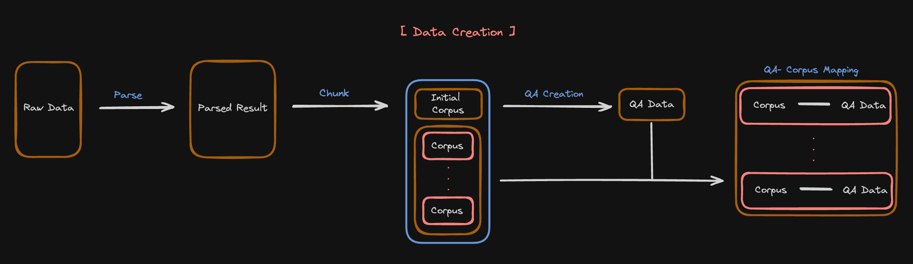

# Start creating your own evaluation data

## Index

1. [Overview](#overview)
2. [Raw data to Corpus data](#make-corpus-data-from-raw-documents)
3. [Corpus data to Qa data](#make-qa-data-from-corpus-data)
4. [Create Custom Function](#use-custom-data-creation-function)


## Overview
For the evaluation of RAGs we need data, but in most cases we have little or no satisfactory data.

However, since the advent of LLM, creating synthetic data has become one of the good solutions to this problem.

The following guide covers how to use LLM to create data in a form that AutoRAG can use.

---


AutoRAG aims to work with Python’s ‘primitive data types’ for scalability and convenience.

Therefore, to use AutoRAG, you need to convert your raw data into `corpus data`  and `qa data` to our [data format](./data_format.md).


## Make corpus data from raw documents
1. Load your raw data to texts with loaders such as lama_index, LangChain, etc.
2. Chunk the texts into passages. Use Langchain, LlamaIndex, etc.
3. Make it into corpus data using util's datatype converter (based on llama_index).

```{tip}
The format for corpus data can be found [corpus data format](data_format.md#corpus-dataset)
```

## Make qa data from corpus data

```{tip}
The format for qa data can be found [qa data format](data_format.md#qa-dataset)
```

```python
from guidance import models
import pandas as pd
from autorag.data.qacreation.simple import generate_simple_qa_dataset, generate_qa_row

corpus_df = pd.read_parquet("path/to/corpus_data")
llm = models.OpenAI("gpt-3.5-turbo")
qa_dataset = generate_simple_qa_dataset(corpus_data=corpus_df, llm=llm, output_filepath="path/to/qa_dataset.parquet", generate_row_function=generate_qa_row)
```
`generate_simple_qa_dataset` is a function designed to generate one **query** and one **generation_gt** per passage of corpus_data.

```{admonition} What is passage?
Passage is chunked units from raw data.
```

## Use custom data creation function
You can change `generate_row_function`  to a custom function to use different templates.

The output of `generate_row_function`  should be in the form of a **dictionary**  containing `query`  and `generation_gt`.

Here is the example of `generate_row_function` using guidance.

```python
import guidance
from guidance import models, gen

# Example for LLM API  
def generate_qa_row(llm: models.Model, corpus_data_row):
    temp_llm = llm

    # make template and synthetic data with guidance 
    with guidance.user():
        temp_llm += f"""
    You have to found a passage to solve "the problem". 
    You need to build a clean and clear set of (problem, passage, answer) in json format 
    so that you don't have to ask about "the problem" again.
    problem need to end with question mark("?").
    The process of approaching the answer based on the information of the given passage 
    must be clearly and neatly displayed in the answer.\n
    \n
   "passage": {corpus_data_row["contents"]}\n
   "problem": 
    """

    with guidance.assistant():
        temp_llm += gen('query', stop="?")
    with guidance.user():
        temp_llm += f"""
        "answer":
        """
    with guidance.assistant():
        temp_llm += gen('generation_gt')
        
    # add metadata in the function
    corpus_data_row["metadata"]["qa_generation"] = "simple"
        
    # make response dictionary
    response = {
        "query": temp_llm["query"],
        "generation_gt": temp_llm["generation_gt"]
    }
    return response
```
