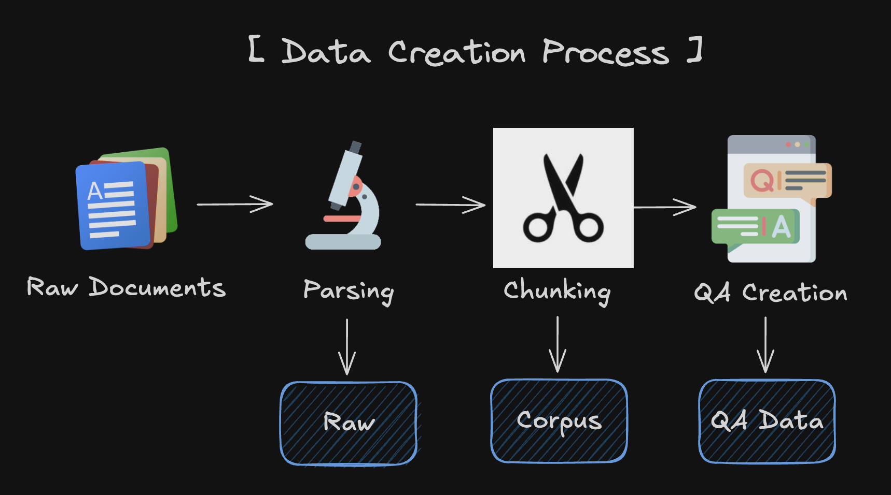

# Evaluation data creation tutorial

## Overview
For the evaluation of RAGs we need data, but in most cases we have little or no satisfactory data.

However, since the advent of LLM, creating synthetic data has become one of the good solutions to this problem.

The following guide covers how to use LLM to create data in a form that AutoRAG can use.

---


## 1. Parsing

### Set YAML File

```yaml
modules:
  - module_type: langchain_parse
    parse_method: pdfminer
```

You can also use multiple Parse modules at once.
However, in this case, you'll need to return a new process for each parsed result.

### Start Parsing

You can parse your raw documents with just a few lines of code.

```python
from autorag.parser import Parser

parser = Parser(data_path_glob="your/data/path/*", project_dir="./parse_project_dir")
parser.start_parsing("your/path/to/parse_config.yaml")
```

Then you can check out the parsing result in the `./parse_project_dir` directory.

For more details about parsing, please refer [here](./parse/parse.md).

## 2. Chunking

### Set YAML File

```yaml
modules:
  - module_type: llama_index_chunk
    chunk_method: Token
    chunk_size: 1024
    chunk_overlap: 24
    add_file_name: en
```

You can also use multiple Chunk modules at once.
In this case, you need to use one corpus to create QA and then map the rest of the corpus to QA Data.

If the chunk method is different, the retrieval_gt will be different, so we need to remap it to the QA dataset.

### Start Chunking

You can chunk your parsed results with just a few lines of code.

```python
from autorag.chunker import Chunker

chunker = Chunker.from_parquet(parsed_data_path="your/parsed/data/path", project_dir="./chunk_project_dir")
chunker.start_chunking("your/path/to/chunk_config.yaml")
```

Then you can check out the chunking result in the `./chunk_project_dir` directory.

For more details about chunking, please refer [here](./chunk/chunk.md).

## 3. QA Creation

### Before you start QA Creation

Corpus and QA are one set.
If multiple corpus are created using multiple chunk methods, each corpus needs its own QA dataset that is mapped.

Therefore, if you have multiple corpus, you need to create an initial QA using one corpus and remap the QA for the remaining corpus to create multiple QA - Corpus Sets.

Chapter 3(QA Creation) describes how to create an Initial QA with one corpus.
Chapter 4(QA - Corpus mapping) describes how to remap the QAs for the rest of the corpus.

If you created your corpus using only one chunking method, you don't need Chapter 4.
However, if you have created a corpus using multiple chunking methods and want to perform chunking optimization, you should refer to Chapter 4.

### Start QA Creation

You can create QA dataset with just a few lines of code.

```python
import pandas as pd
from llama_index.llms.openai import OpenAI

from autorag.data.qa.filter.dontknow import dontknow_filter_rule_based
from autorag.data.qa.generation_gt.llama_index_gen_gt import (
    make_basic_gen_gt,
    make_concise_gen_gt,
)
from autorag.data.qa.schema import Raw, Corpus
from autorag.data.qa.query.llama_gen_query import factoid_query_gen
from autorag.data.qa.sample import random_single_hop

llm = OpenAI()
raw_df = pd.read_parquet("your/path/to/parsed.parquet")
raw_instance = Raw(raw_df)

corpus_df = pd.read_parquet("your/path/to/corpus.parquet")
corpus_instance = Corpus(corpus_df, raw_instance)

initial_qa = (
    corpus_instance.sample(random_single_hop, n=3)
    .map(
        lambda df: df.reset_index(drop=True),
    )
    .make_retrieval_gt_contents()
    .batch_apply(
        factoid_query_gen,  # query generation
        llm=llm,
    )
    .batch_apply(
        make_basic_gen_gt,  # answer generation (basic)
        llm=llm,
    )
    .batch_apply(
        make_concise_gen_gt,  # answer generation (concise)
        llm=llm,
    )
    .filter(
        dontknow_filter_rule_based,  # filter don't know
        lang="en",
    )
)

initial_qa.to_parquet('./qa.parquet', './corpus.parquet')
```

## 4. QA - Corpus mapping

If you have multiple corpus data, you can map the rest of the corpus to the QA dataset.

For the chunking optimization, you can evaluate RAG performance with different corpus data.
You already have the optimal pipeline from the initial QA data,
so you can use this pipeline to evaluate the RAG performance with different corpus data.

Before that, you must update all qa data with the new corpus data.
It uses `update_corpus` method.

It is highly recommending you to keep the initial `QA` instance.
If not, you need to build `QA` instance again from the initial raw (parsed) data and corpus data.

```python
from autorag.data.qa.schema import Raw, Corpus, QA

raw = Raw(initial_raw_df)
corpus = Corpus(initial_corpus_df, raw)
qa = QA(initial_qa_df, corpus)

new_qa = qa.update_corpus(Corpus(new_corpus_df, raw))
```

Now `new_qa` have new `retrieval_gt` data for the new corpus.

Now with the new corpus data and new qa datas, you can evaluate the RAG performance with different corpus data.
