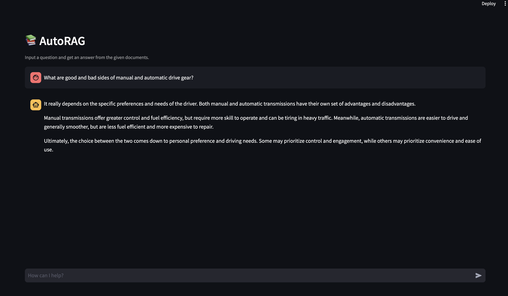

---
myst:
   html_meta:
      title: AutoRAG - Deploy Web Interface
      description: Learn how to deploy optimized RAG pipeline to streamlit web interface in AutoRAG
      keywords: AutoRAG,RAG,RAG deploy,RAG web,Streamlit
---
# Web Interface

## Running the Web Interface
As mentioned in the tutorial, you can run the web interface following the below command:

### 1. Use YAML path
```bash
autorag run_web --yaml_path your/path/to/pipeline.yaml
```

```{admonition} Want to specify project folder?
You can specify project directory with `--project_dir` option or project_dir parameter.
```
```bash
autorag run_web --yaml_path your/path/to/pipeline.yaml --project_dir your/project/directory
```

### 2. Use a trial path
```bash
autorag run_web --trial_path your/path/to/trial
```

### 3. Use Runner
Run the web interface with the `Runner` you created in the YAML file or trial folder.  
If `share=True`, you'll receive an anywhere-accessible link that expires after 72 hours.
```{admonition} Why use Gradio instead of Streamlit?
Since the Streamlit Web Interface always needs to be launched in a new process, we couldn't run it if we were using a custom model. So we replaced it with Gradio, which can be run in the same process
```
```python
from autorag.deploy import Runner

runner = Runner.from_yaml('your/path/to/pipeline.yaml')
runner.run_web()

runner = Runner.from_trial_folder('your/path/to/trial_folder')
runner.run_web(server_name="0.0.0.0", server_port=7680, share=True)
```


### Web Interface example

You can use the web interface to interact with the AutoRAG pipeline.

The web interface provides a user-friendly environment to input queries and receive responses from the pipeline. The web interface is a convenient way to test the pipeline and observe its performance in real-time.

#### Run with CLI



#### Run with AutoRAG Runner


