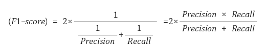
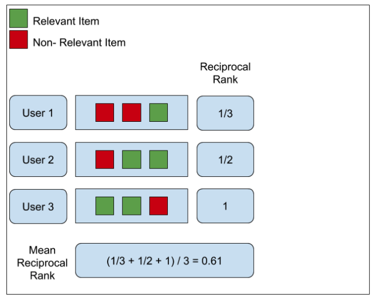
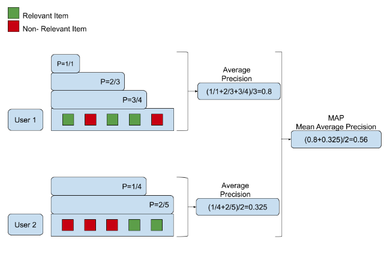
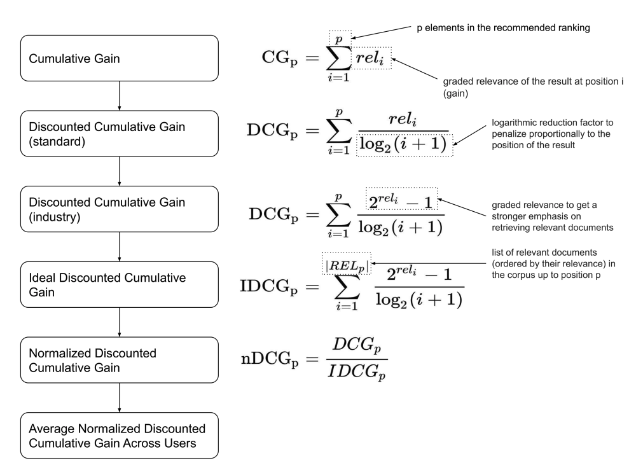

---
myst:
   html_meta:
      title: AutoRAG - RAG retrieval metrics
      description: Learn how to evaluate RAG retrieval in AutoRAG
      keywords: AutoRAG,RAG,RAG evaluation,RAG metrics,RAG metric,retrieval metric,retrieve metric
---
# Retrieval Metrics

## 0. Understanding AutoRAG's retrieval_gt

### ✅Basic Example

(sample) retrieval gt = `[['test-1', 'test-2'], ['test-3']]`

(sample) retrieval result = `['test-1', 'pred-1', 'test-2', 'pred-3']`

---

As you can see from the gt, retrieval_result must contain either 'test-1 or test-2' and test-3 for all answers to be
accepted as correct.

So, if we labeled the retrieval_result as ‘1’ for a correct answer and ‘0’ for an incorrect answer, it would
be `[1, 0, 1, 0]`.

For more information, please refer to the
following [Dataset Format Docs](https://docs.auto-rag.com/data_creation/data_format.html).

In the Apply ‘✅Basic Examples’ below, we'll use the following sample gt and result.
Hopefully you remember them well.

```{tip}
Looking for retrieval metric that do not need any retrieval ground truth?
We support [Ragas context precision](https://docs.ragas.io/en/latest/concepts/metrics/context_precision.html) metric also.
```

## 1. Precision

### 📌Definition

***Precision*** is the percentage of what the model classifies as true that is actually true.

- Also known as **PPV** (Positive Predictive Value).

❗So in AutoRAG, Precision is **(number of correct answers in a result) / (length of a result)**.

### ✅Apply Basic Example

Retrieval resulted in the correct answer `[1, 0, 1, 0]`.

Precision = (number of correct answers in a result) / (length of a result).

So in this case, precision is 2/4 = 0.5.

⌛Summary

- Precision = 2/4 = 0.5

## 2. Recall

### 📌Definition

***Recall*** is the percentage of what the model predicts to be true out of what is actually true.

- In statistics, it's known as ***sensitivity***, and in other fields, the term ***hit rate***.

❗Thus, in AutoRAG, Recall is (number of correct answers in the list in gt) / (length of gt).

### ✅Apply Basic Example

Recall = (number of correct answers in the list in gt) / (length of gt).
So in this case, We need to see how many of the two lists in gt contain the correct answer.

1. `['test-1', 'test-2']`

   The list is correct if at least one of the two correct answers in the list is included in the result.
   The result contains both `test-1` and `test-2`.

   Therefore, this list is correct.

2. `['test-3']`

   The result doesn’t include `test-3`.

   Therefore, this list is incorrect.

The ‘number of lists containing the correct answer’ was 1, and the ‘length of gt’ is 2.

Therefore, Recall is 1/2 = 0.5.

⌛Summary

- Recall = 1/2 = 0.5

## 3. F1 Score

### 📌Definition

***F1 score*** is the harmonic mean of Precision and Recall.



### ✅Apply Basic Example

Consider the result values above.

Precision = 0.5 and Recall = 0.5.

Therefore, the F1 Score = 2*(0.5*0.5)/(0.5+0.5) = 0.5

⌛Summary

- Recall = 1/2 = 0.5

## 4. MRR (Mean Reciprocal Rank)

### 📌Definition

***MRR*** ***(Mean Reciprocal Rank)*** is the average of Reciprocal Rank of the most relevant passage.



### ✅Apply Basic Example

1. `['test-1', 'test-2']`

   Let's find the position of `test-1` and `test-2` in the result, whichever comes first.

   Since test-1 is the first in result, the RR of this list is 1

2. `['test-3']`

   The result doesn’t include `test-3`.

   Therefore, the RR of this list is 0.

Therefore, the MRR is (1 + 0) / 2 = 1/2.

⌛Summary

- RR list = [ 1, 0 ]
- MRR = 1/2

## 5. MAP (Mean Average Precision)

### 📌Definition

***MAP(Mean Average Precision)*** is exactly what it sounds like: the average of ***Average Precision (AP)***, or the
average of the averages.

- Calculate in this order: ***Precision*** → ***Average Precision*** → ***Mean Average Precision***



### ✅Apply Basic Example

1. `['test-1', 'test-2']`
   1. `test-1` is in the first part of result. Therefore, Precision = 1
   2. `test-2` is in the third of the result. Therefore, Precision = 2/3

   ⇒ AP (Average Precision) = (1 + 2/3) / 2 = 5/6

2. `['test-3']`
   1. `test-3` is not included in the result. Therefore, Precision = 0, AP = 0

⇒ So, MRR = (1 + 0) / 2 = 1/2

⌛Summary

- Precision → Average Precision → Mean Average Precision

## 6. NDCG (Normalized Discounted Cumulative Gain)

### 📌Definition

- Calculate in this order: ***CG*** → ***DCG*** → ***IDCG*** → ***NDCG***



1️⃣**CG** (Cumulated Gain)

Cumulated Gain (CG) literally means the cumulative sum of relevance.
However, in the case of CG, if the types of passages in TopN are the same, a model with more relevant passages ranked
higher may perform equally well as a model with less relevant passages.

Therefore, we don't use this value directly but use the DCG with a discount.

2️⃣**DCG** (Discounted Cumulated Gain)

Discounted Cumulated Gain (DCG) is the sum of the relevance divided by the logarithmic rank.

Logarithmicizing the ranking results in a modest increase in value, and dividing relevance by this value indicates that
the impact of relevance is smaller the further down the ranking you go.

In DCG, discounted means to reduce the influence of these later rankings, so that the value of the DCG is more
influenced by the relevance of higher-ranked items and less influenced by the relevance of lower-ranked items.


3️⃣**IDCG** (Ideal-Discounted Cumulated Gain)

The Ideal Discounted Cumulated Gain (IDCG) is the most ideal value of the DCG result. It is absolute and not directly
related to the model.

4️⃣**NDCG**

The normalized Discounted Cumulated Gain (nDCG) refers to the normalized DCG, which means that the DCG for the model's
ranking is divided by the ideal DCG, or IDCG, to give a value between 0 and 1.


NDCG = DCG / IDCG

### ✅Apply Basic Example

If retrieval_result is labeled 1 for the correct answer and 0 for the incorrect answer,
then `[1, 0, 1, 0]`.

- DCG = 1 / log2(1+1) + 0 + 1 / log2(1+3) = 1.5.
- For IDCG, it is ideal if the result contains all of the correct answers test-1, 2, and 3.
  So the ideal result is `[1, 1, 1, 0]`.
  IDCG = 1/log2(1+1) + 1/log2(1+2) + 1 / log2(1+3).
- Therefore, NDCG = DCG / IDCG = 0.7039180890341347.
