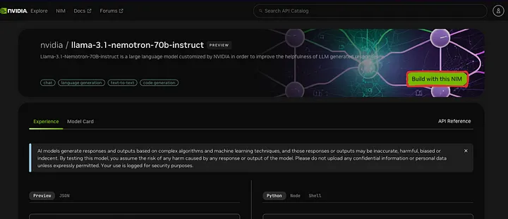

# Nvidia Nim x AutoRAG

## Setting Up the Environment

### Installation

First, you need to have AutoRAG.

Install AutoRAG:

```bash
pip install autorag
```

And go to the NVIDIA NIM [website](https://build.nvidia.com/nim), register, and select what models that you want use.


After select the right model, click “Build with this NIM” Button. And copy your api key!



## Using NVIDIA NIM with AutoRAG
For using NVIDIA NIM, you can use Llama Index LLm's `openailike` at the AutoRAG config YAML file without any further configuration.

It is EASY!

### Writing the Config YAML File
Here’s the modified YAML configuration using `NVIDIA NIM`:

```yaml
nodes:
  - node_line_name: node_line_1
    nodes:
      - node_type: generator
        modules:
          - module_type: llama_index_llm
            llm: openailike
            model: nvidia/llama-3.1-nemotron-70b-instruct
            api_base: https://integrate.api.nvidia.com/v1
            api_key: your_api_key
```
For full YAML files, please see the sample_config folder in the AutoRAG repo at [here](https://github.com/Marker-Inc-Korea/AutoRAG/tree/main/sample_config/rag).

### Running AutoRAG
Before running AutoRAG, make sure you have your QA dataset and corpus dataset ready.
If you want to know how to make it, visit [here](../../data_creation/tutorial.md).

Run AutoRAG with the following command:

```bash
autorag evaluate \
 - qa_data_path ./path/to/qa.parquet \
 - corpus_data_path ./path/to/corpus.parquet \
 - project_dir ./path/to/project_dir \
 - config ./path/to/nim_config.yaml
```

AutoRAG will automatically experiment and optimize RAG.
