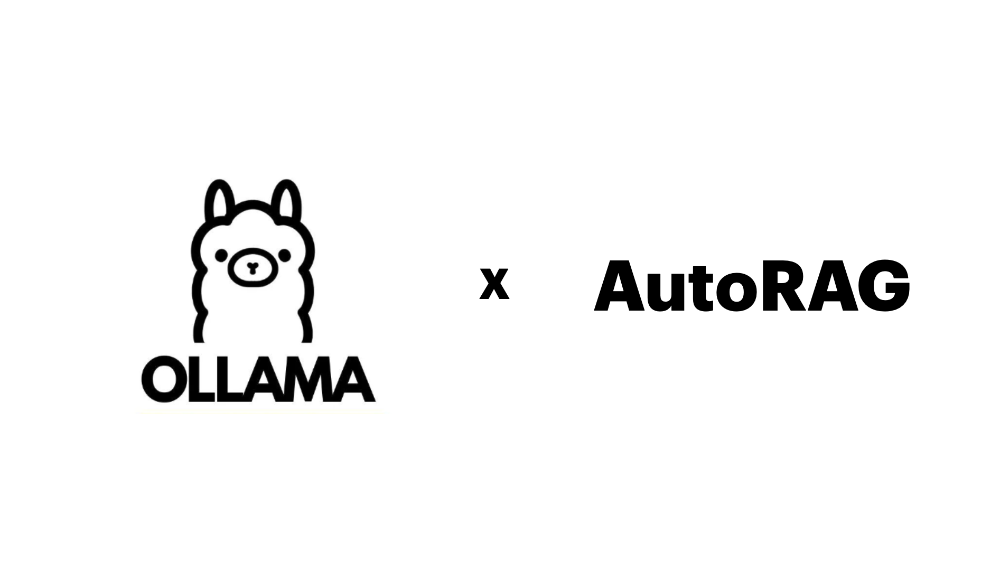

# OLLAMA x AutoRAG



## Setting Up the Environment

### Installation

First, you need to have both AutoRAG and Ollama installed.
Refer to the links below for installation instructions:

- AutoRAG Installation => [Link](../../install.md)
- Ollama Installation => [Link](https://github.com/ollama/ollama?tab=readme-ov-file#ollama)

### Downloading the LLM Model

Download the LLM to be used with Ollama.
In this documentation, we will use the “llama3” LLM.
Enter the following command in the terminal to download the llama3 model.

```bash
ollama pull llama3
```

### Running the Ollama Server

Run the Ollama server by entering the following command in the terminal.

```bash
ollama serve
```
Now, the setup is complete!

## Writing the Config YAML File

To use AutoRAG, a Config YAML file is essential.
By editing this YAML file, you can decide which modules to use, which LLM and embedding models to utilize, and which metrics to experiment with for RAG optimization.

You can use dozens of modules and parameter options, and various metrics.
If you are curious about how to write the Config YAML file, refer to this link.

In this documentation, we designed a simple experiment using only retrieval, prompt maker, and generator (LLM).
You can also check out the YAML file in the [AutoRAG repository](https://github.com/Marker-Inc-Korea/AutoRAG/tree/main/sample_config/rag)!

```{warning}
Be sure to update AutoRAG up to v0.3.17 to use below YAML file.
```

```yaml
vectordb:
  - name: mpnet_base_chroma
    db_type: chroma
    client_type: persistent
    embedding_model: huggingface_all_mpnet_base_v2
    collection_name: huggingface_all_mpnet_base_v2
    path: ${PROJECT_DIR}/data/chroma
node_lines:
  - node_line_name: retrieve_node_line
    nodes:
      - node_type: semantic_retrieval
        strategy:
          metrics: [ retrieval_f1, retrieval_recall, retrieval_precision ]
        top_k: 3
        modules:
          - module_type: vectordb
            vectordb: mpnet_base_chroma
  - node_line_name: post_retrieve_node_line
    nodes:
      - node_type: prompt_maker
        strategy:
          metrics: [ meteor, rouge, bert_score ]
        modules:
          - module_type: fstring
            prompt: "Read the passages and answer the given question. \n Question: {query} \n Passage: {retrieved_contents} \n Answer : "
      - node_type: generator
        strategy:
          metrics: [ meteor, rouge, bert_score ]
        modules:
          - module_type: llama_index_llm
            llm: ollama
            model: llama3
            temperature: [ 0.1, 0.5, 1.0 ]
            batch: 1
```

The Key points of the YAML file are:

```yaml
nodes:
  - node_type: generator
    strategy:
      metrics: [ meteor, rouge, bert_score ]
    modules:
      - module_type: llama_index_llm
        llm: ollama
        model: llama3
        temperature: [ 0.1, 0.5, 1.0 ]
        batch: 1
```

## Running AutoRAG

To run AutoRAG, you must have a QA dataset and a corpus dataset ready.
Refer to this link for information on what data to prepare.

Once you are ready, create an empty directory.
This directory will be the ‘project directory’ where all the optimization results of AutoRAG will be stored.

Now, enter the following command in the terminal to run AutoRAG!
Make sure the Ollama server is running.

```bash
autorag evaluate \
--qa_data_path ./path/to/qa.parquet \
--corpus_data_path ./path/to/corpus.parquet \
--project_dir ./path/to/project_dir \
--config ./path/to/ollama_config.yaml
```

AutoRAG will automatically experiment and optimize RAG.
