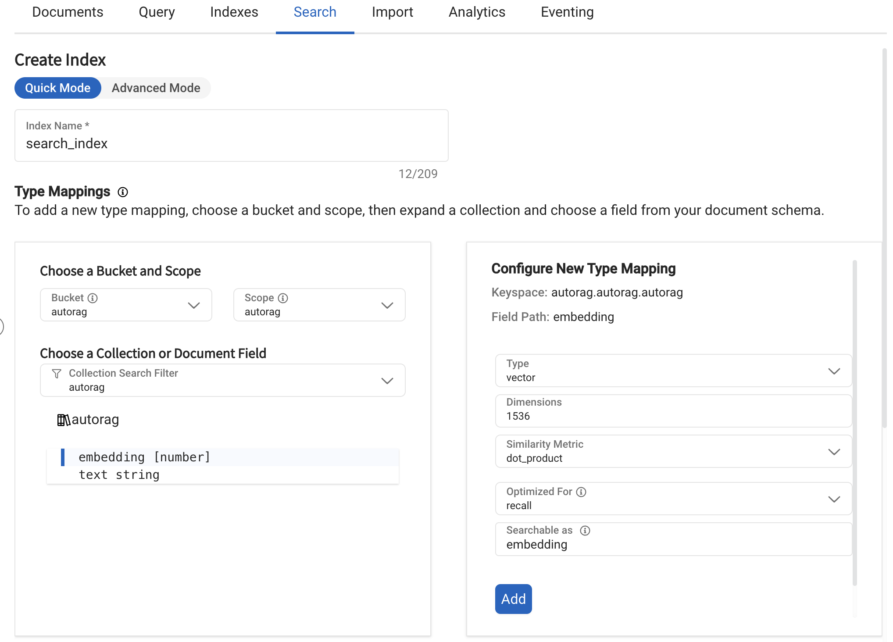

# Couchbase

Couchbase is a highly acclaimed distributed NoSQL cloud database known for its exceptional flexibility, performance, scalability, and cost-effectiveness, making it ideal for cloud, mobile, AI, and edge computing applications.

Vector Search is a part of the [Full Text Search Service](https://docs.couchbase.com/server/current/learn/services-and-indexes/services/search-service.html) (Search Service) in Couchbase.

You can apply these with both [Couchbase Capella](https://www.couchbase.com/products/capella/) and a self-managed Couchbase Server.

## Configuration

This guide will fit Couchbase Capella UI. If you are using a self-managed Couchbase Server, you can see [here](https://docs.couchbase.com/server/current/getting-started/do-a-quick-install.html).

To use the Couchbase vector database, you need to configure it in your YAML configuration file.

First, you need to set the Couchbase cluster connection information.

### Edit Cluster Access
Set Access `username`, `password` and `connection_string` for the Couchbase cluster.

And set bucket, scope and access level(Read/Write) for the Couchbase cluster.

### Allowed IP Addresses

You need to allow the IP address of the VectorDB server in the Couchbase cluster.

### Cluster, Bucket, Scope, Collection

`Cluster`, `Bucket` must be prepared in advance.

`Scope` and `Collection` should be prepared in advance, otherwise they will be created automatically.

### Create Index for Query



This should correspond to the `dimension` of the embeddings generated by the specified embedding model.

### Example YAML file

```yaml
- name: openai_couchbase
  db_type: couchbase
  embedding_model: openai_embed_3_large
  bucket_name: autorag   # replace your bucket name
  scope_name: autorag   # replace your scope name
  collection_name: autorag   # replace your collection name
  index_name: autorag_search   # replace your index name
  connection_string: ${COUCHBASE_CONNECTION_STRING}
  username: ${COUCHBASE_USERNAME"}
  password: ${COUCHBASE_PASSWORD"}
```

Here is a simple example of a YAML configuration file that uses the Couchbase vector database and the OpenAI:

```yaml
vectordb:
  - name: openai_couchbase
    db_type: couchbase
    embedding_model: openai_embed_3_large
    bucket_name: autorag   # replace your bucket name
    scope_name: autorag   # replace your scope name
    collection_name: autorag   # replace your collection name
    index_name: autorag_search   # replace your index name
    connection_string: ${COUCHBASE_CONNECTION_STRING}
    username: ${COUCHBASE_USERNAME"}
    password: ${COUCHBASE_PASSWORD"}
node_lines:
- node_line_name: retrieve_node_line  # Arbitrary node line name
  nodes:
    - node_type: retrieval
      strategy:
        metrics: [retrieval_f1, retrieval_recall, retrieval_precision]
      top_k: 3
      modules:
        - module_type: vectordb
          vectordb: openai_couchbase
- node_line_name: post_retrieve_node_line  # Arbitrary node line name
  nodes:
    - node_type: prompt_maker
      strategy:
        metrics: [bleu, meteor, rouge]
      modules:
        - module_type: fstring
          prompt: "Read the passages and answer the given question. \n Question: {query} \n Passage: {retrieved_contents} \n Answer : "
    - node_type: generator
      strategy:
        metrics: [bleu, rouge]
      modules:
        - module_type: llama_index_llm
          llm: openai
          model: [ gpt-4o-mini ]
```

### Parameters

1. `embedding_model: str`
   - Purpose: Specifies the name or identifier of the embedding model to be used.
   - Example: "openai_embed_3_large"
   - Note: This should correspond to a valid embedding model that your system can use to generate vector embeddings. For more information see [custom your embedding model](https://docs.auto-rag.com/local_model.html#configure-the-embedding-model) documentation.

2. `embedding_batch: int = 100`
   - Purpose: Determines the number of embeddings to process in a single batch.
   - Default: 100
   - Note: Adjust this based on your system's memory and processing capabilities. Larger batches may be faster but require more memory.

3. `bucket_name: str`
   - Purpose: Specifies the name of the bucket where the vectors will be stored.
   - Example: "my_bucket"
   - Note: Bucket must be prepared in advance.

4. `scope_name: str`
   - Purpose: Specifies the name of the scope where the vectors will be stored.
   - Example: "my_scope"
   - Note: If the scope doesn't exist, it will be created. If it exists, it will be loaded.

5. `collection_name: str`
    - Purpose: Specifies the name of the collection where the vectors will be stored.
    - Example: "my_collection"
    - Note: If the collection doesn't exist, it will be created. If it exists, it will be loaded.

6. `index_name: str`
    - Purpose: Specifies the name of the Couchbase index to be used for querying.
    - Example: "my_vector_index"
    - Note: Index must be prepared in advance.

7. `connection_string: str`
    - Purpose: Specifies the connection string for the Couchbase cluster.
    - Note: This should be the connection string for your Couchbase cluster.

8. `username: str`
    - Purpose: Specifies the username for authentication with the Couchbase cluster.
    - Note: This should be the username for your Couchbase cluster.

9. `password: str`
    - Purpose: Specifies the password for authentication with the Couchbase cluster.
    - Note: This should be the password for your Couchbase cluster.

10. `ingest_batch: int = 100`
    - Purpose: Determines the number of vectors to ingest in a single batch.
    - Default: 100
    - Note: Adjust this based on your system's memory and processing capabilities. Larger batches may be faster but require more memory.

11. `text_key: str = "text"`
    - Purpose: Specifies the key in the document where the text data is stored.
    - Default: "text"
    - Note: This should correspond to the key in the document where the text data is stored.

12. `embedding_key: str = "embedding"`
    - Purpose: Specifies the key in the document where the vector embeddings are stored.
    - Default: "embedding"
    - Note: This should correspond to the key in the document where the vector embeddings are stored.

13. `scoped_index: bool = True`
    - Purpose: Specifies whether the index is scoped to the collection.
    - Default: True
    - Note: If True, searches in the scope. If False, searches across the entire cluster.

## Usage

Here's a brief overview of how to use the main functions of the Couchbase vector database:

1. **Adding Vectors**:
   ```python
   await couchbase_db.add(ids, texts)
   ```
   This method adds new vectors to the database.
   It takes a list of IDs and corresponding texts, generates embeddings, and inserts them into the Couchbase Collection.

2. **Querying**:
   ```python
   ids, scores = await couchbase_db.query(queries, top_k)
   ```
   Performs a similarity search on the stored vectors.
   It returns the IDs and their scores.
   Below you can see how the score is determined.

3. **Fetching Vectors**:
   ```python
   vectors = await couchbase_db.fetch(ids)
   ```
   Retrieves the vectors associated with the given IDs.

4. **Checking Existence**:
   ```python
   exists = await couchbase_db.is_exist(ids)
   ```
   Checks if the given IDs exist in the database.

5. **Deleting Vectors**:
   ```python
   await couchbase_db.delete(ids)
   ```
   Deletes the vectors associated with the given IDs from the database.
