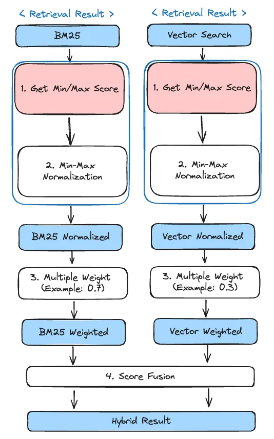

# Hybrid - rsf

The `hybrid-rsf` module is designed to retrieve passages from multiple retrievals.

## What is rsf?

- Relative Score Fusion [(Weaviate)](https://weaviate.io/blog/hybrid-search-fusion-algorithms)

RelativeScoreFusion(RSF) derives each objects score by normalizing the metrics output by `target_modules` search
respectively. The highest value becomes 1, the lowest value becomes 0, and others end up in between according to this
scale. The total score is thus calculated by a scaled sum of normalized `target_modules` score.

## ❗️Hybird additional explanation

By default, `hybrid` is designed to be used without writing target_module_params. Other modules listed in target_modules
must be included in the config file, and hybrid is calculated based on the best of the results from those modules.

Once evaluated to find the optimal pipeline, extracting the pipeline creates a parameter called target_module_params.
This helps the hybrid work even if you don't include other modules, which is useful in test dataset evaluation and
deployment situations.

Also, target_modules and target_module_params must be in the form of a tuple. By default, tuples don't work in yaml
files, but AutoRAG specifically uses them. In the AutoRAG config yaml file, a tuple is a tuple of parameters, as opposed
to a List, which is a list of options for a parameter that you can try for optimization. Note that because we are
using `ast.literal_eval()`, we have to write tuples as if we were writing them in python.

So something like `('bm25', 'vectordb')` with quotes will work.

## 📌 Score Fusion additional explanation

`Hybrid-dbsf` module and `Hybrid-rsf` module are similar in that they both use score fusion algorithm.

Here is the Score Fusion algorithm's flow:



1. Get the Min/Max Score
2. Apply Min-Max Normalization
3. Multiply weights
4. Score Fusion

There are four main steps in the flow as follows

RSF and DBSF differ only in the method for finding the Min-Max Score in step 1 (colored pink in the figure), while steps
2, 3, and 4 are the same!

Learn how to find the RSF-specific Min-Max Score !!

### 1. Get the Min/Max Score in RSF ⭐⭐⭐

As the term Relative suggests, the Min and Max scores for RSF are determined relatively.

What does relative mean?

It literally means that the largest of the scores will be the Max Score and the smallest will be the Min Score.

Let's look at an example, which is much simpler to understand.

Let's say Score list: [1, 3, 5].

Then the Max value of the score list is 5 and the Min value is 1.

Steps 2, 3, and 4 below are the same as for DBSF.

### 2. Apply Min-Max Normalization

`scaled_score = (score - min_score) / (max_score - min_score)`

Min-Max Normalization is a technique that scales the range of values from 0 to 1.

After scaling, the minimum value is 0 and the maximum value is 1.

For example, if you normalize a Score of [1, 3, 5], it becomes [0, 0.5, 1].

### 3. Multiply weights

Since we are looking at a hybrid retrieval module, we need to multiply each Normalized Score by a Weight.

Let's say we have a Score of [0, 0.25, 1] and a Score of [0, 0.5, 1].

If Weight is 0.7 and 0.3, we simply multiply the respective Score values by 0.7 and 0.3!

### 4. Score Fusion

Score Fusion is literally the process of combining the two weighted scores we got!

- id: [`id_1`, `id_2`, `id_3`], Score: [0.1, 0.2, 0.7]
- id: [`id_2`, `id_3`, `id_4`], Score: [0.3, 0.8, 0.2]

Suppose we have the following two results

There is only one `id_1` and `id_4`, and two `id_2` and `id_3`.

Then we can combine the two results as follows

- id_1 : 0.1
- id_2 : 0.2 + 0.3 = 0.5
- id_3 : 0.7 + 0.8 = 1.5
- id_4 : 0.2

The example assumes a situation where top_k is 3, so if we pick the top 3 in score order, we get

- Id: [`id_3`, `id_2`, `id_4`], Score: [1.5, 0.5, 0.2].

## **Module Parameters**

- **Parameters**: `target_modules`, `weights`, `target_module_params`
- **Purpose**: This module combines different retrieval modules (target_modules) and applies weights to them, adjusting
  their influence on the final retrieval outcome. The `target_module_params` allows for further customization of each
  target module.

```{attention}
In the config YAML file that you wrote, you don't have to specify the target_module_params. 
It is automatically generated when you run the optimization process.
```

## **Example config.yaml**

```yaml
modules:
  - module_type: hybrid_rsf
    target_modules: ('bm25', 'vectordb')
    weights:
      - (0.5, 0.5)
      - (0.3, 0.7)
      - (0.7, 0.3)
```
