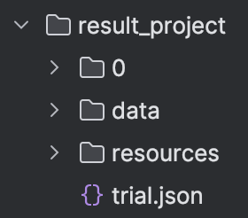
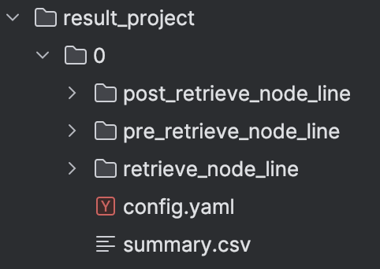
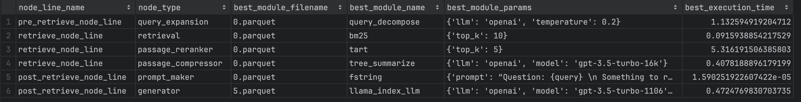
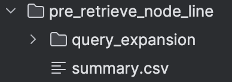
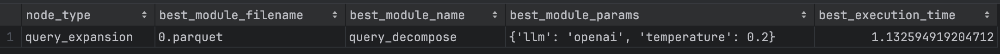
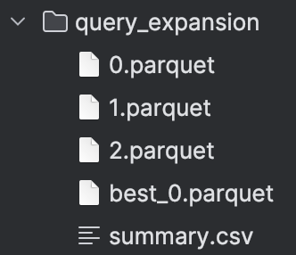
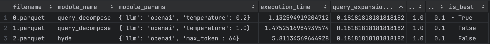
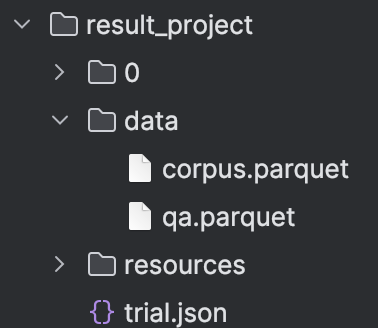
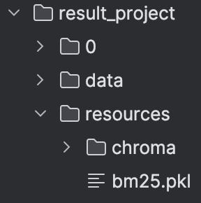
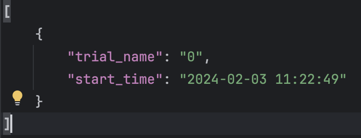

---
myst:
   html_meta:
      title: AutoRAG - Folder Structure
      description: Learn how the result folder looks like in AutoRAG
      keywords: AutoRAG,RAG,AutoRAG folder
---
# Folder Structure

## Sample Structure Index
- [Project](#project)
  - [trial](#trial)
    - [config.yaml](#configyaml)
    - [summary.csv](#trial-summarycsv)
    - [Node_line_name](#pre_retrieve_node_line)
      - [summary.csv](#node-line-summarycsv)
      - [Node name](#query_expansion)
        - 0.parquet
        - ...
        - best_(index).parquet
        - [summary.csv](#node-summarycsv)
    - [Node_line_name](#retrieve_node_line)
      - Node name
        - ...
      - Node name
        - ...
  - [data](#data)
  - [resources](#resources)
  - [trial.json](#trialjson)


## Project
In a project, you have to do an experiment with only one dataset.
The project folder is where the user runs from.



### trial

Trial means a single run of the experiment.
Each trial can be run with different settings using different config YAML files.
If there are multiple trail folders, it means you ran experiments more than once.
We recommend running multiple trials on the same data with different settings to find the best RAG pipeline.

The folder names are determined by the number of trials run.
The first trial folder is named `0`, the second trial folder is named `1`, and so on.
You can check this out at the [trial.json](#trialjson) file, too.



#### config.yaml
The YAML file you used for this trial.
```{Tip}
You can see a sample full [config.yaml](sample_full_config.yaml).
```
#### [trial] summary.csv
Full trial summary csv file


There are node lines, selected modules, files and parameters used by the selected modules,
and the time it took to process in one row.



#### pre_retrieve_node_line



##### [Node Line] summary.csv


Contains the best modules and settings selected from each node.
You can see the node, the selected modules, their files and parameters used, and the time it took to process a row.

```{seealso}
Need to know what to do with Node Line?
Check out [Roadmap to Modular RAG](../roadmap/modular_rag.md).
```


##### query_expansion
Node names belonging to the node_line



Depending on the module and module params, you can run different experiments on a node.
The following image shows three experiments on a node.

- 0.parquet
- 1.parquet
- …
- best_(index).parquet ⇒ Top results on a node

```{tip}
In the image, the first result is the best of the three experiments, so the best file name is best_0.
```


###### [Node] summary.csv
Results for each node. All attempts and evaluation metric results are recorded.



#### retrieve_node_line

```{attention}
All other node lines and nodes are organized in the same format as above.
It would be too long to explain it all, but we hope you understand the structure.
```

### data



- corpus.parquet ⇒ corpus dataset
- qa.parquet ⇒ qa dataset
  ```{tip}
  QA data can exist only as qa.parquet, but it is recommended to split it into train and test for more accurate optimization.
  Check out [here](../data_creation/tutorial.md) for how to build a qa dataset and corpus dataset.
  ```

### resources



- `bm25.pkl`: created when using bm25
- `chroma`: created when using vectordb
    - collection_name = the name of the `embedding model`

### trial.json

It contains information about each trial.


