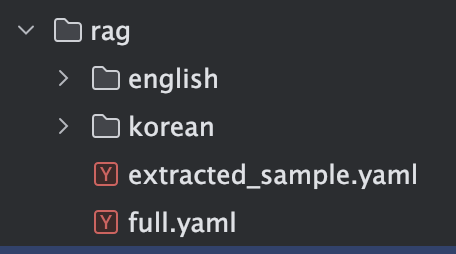
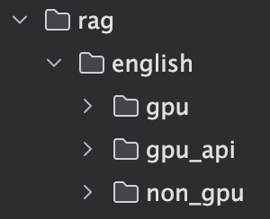
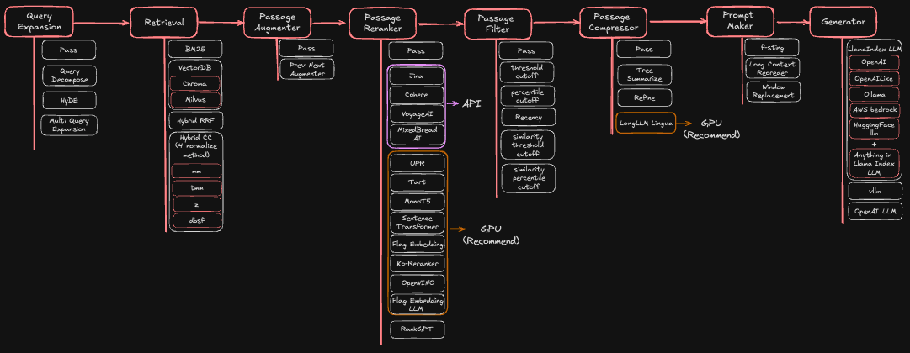
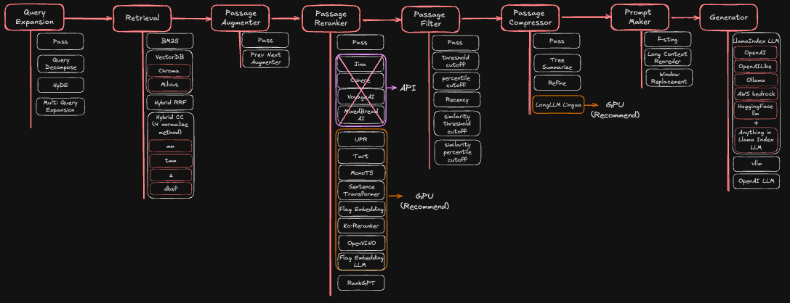
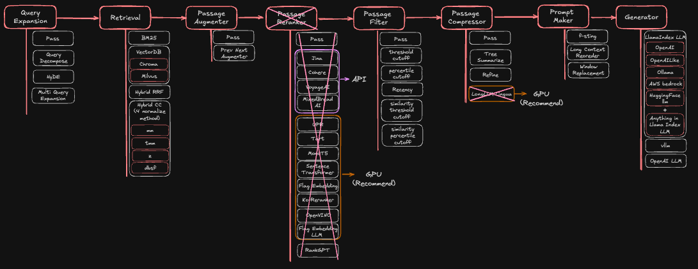
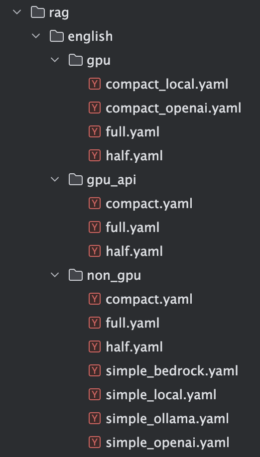
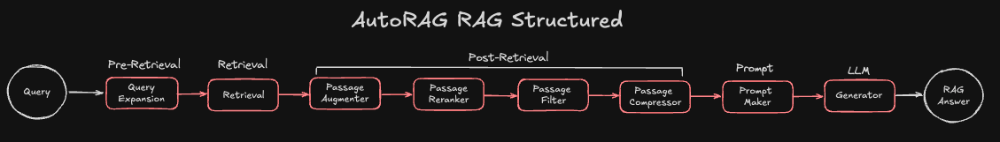
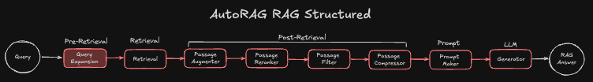
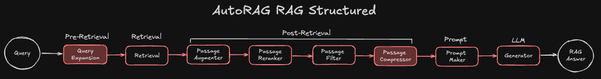
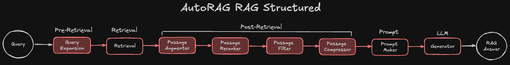

---
myst:
   html_meta:
      title: AutoRAG - Sample YAML file guide
      description: Description of the sample YAML file for AutoRAG
      keywords: AutoRAG,RAG,RAG optimization,AutoRAG YAML,AutoRAG config, Sample YAML file
---
# Sample YAML file guide



We first categorized them into English and Korean.

Korean consists of only modules that support Korean, such as Korean prompts and Korean rerankers for modules that use LLMs.

We have divided the sample YAML file into three main parts.



I'll explain how it was divided based on the full.yaml in each folder.

### GPU + API



- `API`: Four Reranker Modules that use APIs except for the Embedding Model and LLM
- `GPU (recommend`): The Reranker module and the LongLLM Lingua module in the Compressor Node, which can take a long time if you don't use the GPU and only use the CPU.

#### Get API Key
- JINA AI: You can get API Key [here](https://jina.ai/reranker/)

    ```bash
    export JINAAI_API_KEY=your_jina_api_key
    ```

- Cohere: You can get API Key [here](https://cohere.com/)

    ```bash
    export COHERE_API_KEY=your_cohere_api_key
    ```

- VoyageAI:You can get API Key [here](https://docs.voyageai.com/docs/api-key-and-installation)

    ```bash
    export VOYAGE_API_KEY=your_voyageai_api_key
    ```

- Mixbread AI: You can get API Key [here](https://www.mixedbread.ai/api-reference#quick-start-guide)

    ```bash
    export MXBAI_API_KEY=your_mixedbread_api_key
    ```

### GPU

This excludes the four Reranker modules, which require a separate API key to use.



### Non GPU

Exclude API and GPU Recommend from all.



---



Each folder is again organized into Full, Half, Compact, and even Simple for non-GPUs.

### Full



### Half

Exclude `Query Expansion` Node from Full



### Compact

Exclude `Passage Compressor` Node from Half



### Simple

This is the YAML file for the Naive RAG that leads to `Retrieval` → `Prompt Maker` → `Generator`.

I only put it in the Non-GPU folder because it is the only Node that runs in a non-GPU environment.


