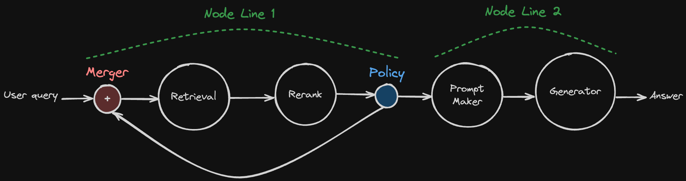

# Road to Modular RAG

## 🤷‍♂️ What is Modular RAG?

In a survey [paper](https://arxiv.org/abs/2312.10997v1) about RAG, they propose three paradigms of RAG.


At first, Naive RAG is a simple RAG paradigm. 
It embeds document chunks to Vector DB, and retrieves using a user query, and generates answer with that retrieved document chunks.

You can build Naive RAG really easy these days. 
All you need is following tutorial of Langchain or LlamaIndex, or other RAG frameworks out there.
However, there are performance issues with Naive RAG.
If you ever try Naive RAG, you know the performance can be bad at real use-cases.

So, here comes the second paradigm, Advanced RAG.
Advanced RAG supports few pre-retrieval and post-retrieval features, like reranking, query expansion, and so on.
It is more powerful than Naive RAG, but still it is not perfect.

The main problem of Advanced RAG is that it still doesn't have **cycles**. Why are cycles important?

For example, the LLM model generates answer, but it has hallucination about facts. 
If that answer delivers to the user, the user gets wrong information, and it occurs the bad user experience.
To prevent this, we need to check the answer's fatefulness.
And if there is a hallucination, you can ask generator to re-generate answer or retrieve document chunk again.
In a DAG paradigm like Naive RAG & Advance RAG, it is impossible to do that because they don't have cycles.
And here comes Modular RAG.

Modular RAG has cycles and modules, so it can decide the next step to deliver the best answer to the user.

```{admonition} Want to know more about Modular RAG?
- Recommend to read the survey [paper](https://arxiv.org/abs/2312.10997v1).
```

## 🚀 Road to Modular RAG

In this version of `AutoRAG`, we support Advanced RAG only.
However, we know how Modular RAG is important to RAG pipelines, so we are planning to support Modular RAG ASAP.

Let me explain our plan to implement Modular RAG.

### Early version of AutoRAG


Here is a simple diagram of Advanced RAG.
Think each circle as a node.
User query goes to retriever, retrieves document chunk, and rerank, make prompt and generate answer.

You can build this kind of pipeline with `AutoRAG` easily from now. 

```{tip}
If you don't know yet how to build pipeline and optimize it, 
please see [optimization](../optimization/optimization.md) guide.
```

### Policy Node

```{warning}
This document is about our *plan*, so it can be changed in the future.
Also, it is not implemented to `AutoRAG` yet.
```


We are planning to add a new node, Policy Node.
Can you see the little blue node in the diagram?
That is the policy node.
It gets a previous result from previous nodes, and decides the next step based on that result.

In this example, the policy gets prompt, and selects which Generator model is good for generating the final answer.

### Merger Node

There is a limitation of the policy node that it can't merge the results again.
Once policy takes its action, it can't merge the results again without `Merger Node`.

With merger node, we can now create **cycles** in the RAG pipeline.


Here is a diagram that used Merger node.
At first, there is a policy that gets retrieved document chunks as input.
It decides to rerank it, or just compress long document chunks to short passage.
After that, it must pass to a single prompt maker node. 
And then, here comes `Meger Node`.
It gets the result from multiple nodes, and passes it to the next node.
In this way, prompt maker node gets passages to make prompt, no matter how the policy node decides.

So, how can make cycle with `Merger Node`?
Let me show you an example.


Pretty good, right? 
The policy in the above diagram decides a reranked result passed to the prompt maker for generation, 
or request retrieve again. 
At merger that located before the retrieval node, it gets the user query and passed to the retrieval node.

Voilà! We made a cycle in the RAG pipeline. 
But we have a problem implementing this to `AutoRAG`. 
How can we make this to single yaml file? 
How can we make complex Modular RAG pipelines using yaml file alone?

### Node line for Modular RAG

The solution is `Node Line`. 
If you learned about structure of `AutoRAG` config file, you are familiar with `Node Line`.

```{admonition} What is Node Line?
If you are not familiar with `Node Line`, please see [optimization](../optimization/optimization.md) guide.
```

In the Advanced RAG, Node line is like a folder.
There is no much feature on it, just collection of nodes.

But think of this way. A single Node line is like a straight line. It is a linear structure.
It does not have any branches or cycles.

And the magic happens as policy node and merger node only. 
You can type which node line can be the next step at policy node.
If the node line is the target of the policy, you must set merger node to merge the results from the node line.



In the above diagram, I made two node lines to implement the cycle.
You can write your config yaml file for making the above pipeline like below.

```yaml
node_lines:
  - node_line_name: node_line_1
    nodes:
      - node_type: merger
        pass_value: query
      - node_type: retrieval
        strategy:
          metrics: [retrieval_recall]
        top_k: 10
        modules:
          - module_type: bm25
      - node_type: passage_reranker
        strategy:
          metrics: [reranker_recall]
        top_k: 3
        modules:
          - module_type: upr
      - node_type: policy
        target_node_lines:
          - node_line_1
          - node_line_2
        modules:
          - module_type: kf1_policy
          - module_type: rl_policy
  - node_line_name: node_line_2
    nodes:
      - node_type: prompt_maker
        modules:
          - module_type: fstring
            prompt: "Answer the question: {query} \n\n Passage: {retrieved_contents}"
      - node_type: generator
        strategy:
          metrics: [bleu, rouge, meteor]
        modules:
          - module_type: llama_index_llm
            llm: openai
```

Looks cool, right?

## Contact us

We are tyring hard to make Modular RAG at `AutoRAG` as soon as possible.
If you are really interested in Modular RAG, feel free to contact us.
We are welcoming any questions, suggestions, feature requests, feedback, and so on.

```{admonition} Contact
- Github Issue : https://github.com/Marker-Inc-Korea/AutoRAG/issues
- Discord : https://discord.gg/P4DYXfmSAs
```
