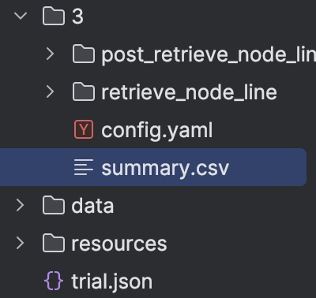

---
myst:
  html_meta:
    title: AutoRAG - Tutorial
    description: The great start point to optimize your RAG pipeline. RAG tutorial for RAG developers.
    keywords: AutoRAG,RAG,RAG tutorial,AutoRAG tutorial
---

# Tutorial

```{tip}
Before start this tutorial, make sure you installed AutoRAG.
To install it, please check [Installation](install.md).
```

```{admonition} Colab Tutorial
Do you use Colab? You can check out Colab tutorial at [here](https://colab.research.google.com/drive/19OEQXO_pHN6gnn2WdfPd4hjnS-4GurVd?usp=sharing).
```

## Prepare Evaluation Dataset

First, you have to prepare an evaluation dataset for your RAG pipeline.
Making a good evaluation dataset is the key to getting a good RAG pipeline.
So, you need to focus on the quality of your evaluation dataset.
Once you have it, the optimal RAG pipeline can be found using AutoRAG easily.

So, for users who want to make a good evaluation dataset,
we provide a detailed guide at [here](data_creation/beta/data_creation.md).

For users who want to use a pre-made evaluation dataset,
we provide example datasets at [here](data_creation/data_format.md#samples).

Also, you can check out sample datasets
at [huggingface](https://huggingface.co/collections/MarkrAI/autorag-evaluation-datasets-65c0ee87d673dcc686bd14b8).
You can download it manually using huggingface datasets library.

```{attention}
Don't forget to split train and test dataset.
It is common mistake to not split dataset, but it will occur overfitting issue.
We highly recommend you to optimize RAG pipeline with train dataset, and evaluate whole pipeline with test dataset later.
```

After you prepare your evaluation dataset, please keep in mind the path to your dataset.

```{admonition} Note: Dataset Format
Make sure there are two evaluation datasets, qa dataset and corpus dataset.
And you must save it as parquet format.
If you don't know about specific columns and data types, check out the [Data Format](data_creation/data_format.md) section.
```

## Find Optimal RAG Pipeline

Let's find an optimal RAG pipeline with AutoRAG!
After you prepare your evaluation dataset, you need to have a config YAML file.
There are few pre-made config YAML files at our GitHub repo `sample_config` folder.
We highly recommend using pre-made config YAML files for starter.
Download `starter.yaml` file to your local environment, and you are ready to go.

```{admonition} Write custom config yaml file
If you want to write your own custom config yaml file for detailed configuration and experiment,
check out the [optimization](optimization/optimization.md) section.
```

### Validate your system

Before you start the optimization, you might need to validate your system.
When you run AutoRAG, there might be an error in your YAML file, python dependencies, GPU error, or unexpected errors.
So it is recommended to run the validation.
It runs the whole optimization but only to find a system error with minimum cost.

You can run validation with a cli command.

```bash
autorag validate --config your/path/to/default_config.yaml --qa_data_path your/path/to/qa.parquet --corpus_data_path your/path/to/corpus.parquet
```

Or you can use python code like below.

```python
from autorag.validator import Validator

validator = Validator(qa_data_path='your/path/to/qa.parquet', corpus_data_path='your/path/to/corpus.parquet')
validator.validate('your/path/to/default_config.yaml')
```

### Run AutoRAG optimization

Run below code at CLI, then AutoRAG automatically evaluate your dataset and find the best RAG pipeline for your dataset.

```bash
autorag evaluate --config your/path/to/default_config.yaml --qa_data_path your/path/to/qa.parquet --corpus_data_path your/path/to/corpus.parquet --project_dir ./your/project/directory
```

Or you can use python code like below.

```python
from autorag.evaluator import Evaluator

evaluator = Evaluator(qa_data_path='your/path/to/qa.parquet', corpus_data_path='your/path/to/corpus.parquet',
                      project_dir='your/path/to/project_directory')
evaluator.start_trial('your/path/to/config.yaml')
```

Once it is done, you can see several files and folders created in your current directory.
These files and folders contain all information about the evaluation results and the best RAG pipeline for your data.

<p align="center">
	
</p>

The First thing you can see might be a folder named after a number, which is 3 in the above image.
This is the trial folder that contains all results that you run above.
The number is the trial number, and you can check when you run the evaluation at `trial.json` file.

And the most important file is `summary.csv` files.
You can check out which module and parameters are the best for your dataset.
And there are lots of details inside node line and node folders.
You can find out more information about folder structure and result files at [here](structure.md).

```{admonition} Want to specify project folder?
You can specify project directory with `--project_dir` option or project_dir parameter.
```

```{admonition} Why use python command?
You have to use python command when you want to add custom LLM models or custom embedding models.
Because the addition process must be executed as python code.
Please refer [this document](https://docs.auto-rag.com/local_model.html) to know how to add custom LLM or embedding models.
```

### ❗Restart a trial if an error occurs during the trial

If an error occurs during the trial, you can restart the trial.

If you had issues with the `config.yaml` file, you can modify the `config.yaml` file in the trail folder and run the
code below.

Run below code at CLI, then AutoRAG automatically restarts the evaluation.

```bash
autorag restart_evaluate --trial_path your/path/to/trial_folder
```

Or you can use python code like below.

```python
from autorag.evaluator import Evaluator

evaluator = Evaluator(qa_data_path='your/path/to/qa.parquet', corpus_data_path='your/path/to/corpus.parquet')
evaluator.restart_trial(trial_path='your/path/to/trial_path')
```

```{admonition} What if Trial_Path didn't also create a First Node Line?
If the First Node Line folder has not been created in the trial path you want to restart,
start_trial function will be executed instead of restart_trial.

Note that a new trial folder will be created, not a new restart result in that Trial Path.
```

## Run Dashboard to see your trial result!

Up to AutoRAG version 0.2.0, you can use the dashboard feature to easily see the results of AutoRAG.
You can run the dashboard just running below command.

```bash
autorag dashboard --trial_dir /your/path/to/trial_dir
```

## Extract pipeline and evaluate test dataset

Now, it's time to evaluate test dataset with a found RAG pipeline. For this, you can extract the optimal pipeline and
save it to a new config YAML file.

You can use the below code.

Remind that your trial folder is in the directory you run the `Evaluator`.
And the trial folder name is number, like 0, 1, 2, 3, and so on.

Run below code at CLI, then AutoRAG automatically extracts the optimal pipeline and saves it to a new YAML file.

```bash
autorag extract_best_config --trial_path your/path/to/trial_folder --output_path your/path/to/pipeline.yaml
````

Or you can use python code like below.

```python
from autorag.deploy import extract_best_config

pipeline_dict = extract_best_config(trial_path='your/path/to/trial_folder', output_path='your/path/to/pipeline.yaml')
```

You can check out your pipeline YAML file at `your/path/to/pipeline.yaml`.
And then, run evaluation with test dataset again.

```{caution}
Run evaluation to another folder.
Running evaluation with another dataset in same folder can cause serious malfunction.
```

```bash
autorag evaluate --config your/path/to/pipeline.yaml --qa_data_path your/path/to/qa_test.parquet --corpus_data_path your/path/to/corpus_test.parquet
```

It will evaluate your test dataset with the found RAG pipeline.

## Deploy your optimal RAG pipeline

### 1. Run as a Code

You can use a found optimal RAG pipeline right away with an extracted YAML file.

```python
from autorag.deploy import Runner

runner = Runner.from_yaml('your/path/to/pipeline.yaml')
runner.run('your question')
```

Or you can use the trial folder to run the pipeline without extracted YAML file.

```python
from autorag.deploy import Runner

runner = Runner.from_trial_folder('/your/path/to/trial_dir')
runner.run('your question')
```

### 2. Run as an API server

You can run this pipeline as an API server.

Check out the API endpoint at [here](deploy/api_endpoint.md).

```python
from autorag.deploy import ApiRunner
import nest_asyncio

nest_asyncio.apply()

runner = ApiRunner.from_yaml('your/path/to/pipeline.yaml', project_dir='your/project/directory')
runner.run_api_server()
```

or

```python
from autorag.deploy import ApiRunner
import nest_asyncio

nest_asyncio.apply()

runner = ApiRunner.from_trial_folder('/your/path/to/trial_dir')
runner.run_api_server()
```

```bash
autorag run_api --trial_dir /trial/dir/0 --host 0.0.0.0 --port 8000
```

```{admonition} Want to specify project folder?
You can specify project directory with `--project_dir` option or project_dir parameter.
```

### 3. Run as a Web Interface

you can run this pipeline as a web interface.

Check out the web interface at [here](deploy/web.md).

```python
from autorag.deploy import GradioRunner

runner = GradioRunner.from_yaml('your/path/to/pipeline.yaml')
runner.run_web()
```

```python
from autorag.deploy import GradioRunner

runner = GradioRunner.from_trial_folder('/your/path/to/trial_dir')
runner.run_web()
```

The cli will run the streamlit web interface, but the code is gradio version.

```bash
autorag run_web --yaml_path your/path/to/pipeline.yaml
```

```bash
autorag run_web --trial_path your/path/to/trial_dir
```

```{admonition} Want to specify project folder?
You can specify project directory with `--project_dir` option or project_dir parameter.
```

```{hint}
Why don't you share your work and evaluation results with others?
You can simply share your yaml file, or `summary.csv` file.
With that, you can share whole RAG pipeline and evaluation results to others.

Feel free to share your work at our [Discord](https://discord.gg/P4DYXfmSAs) channel!
```

And that's it!
You successfully found the optimal RAG pipeline for your dataset and deployed it.
Now, you can make your custom config file, write a better config YAML file,
and evaluate it again and again for the better result.

Or just launch a new RAG product with your saved time with AutoRAG!

```{admonition} Next Step
- Learn about evaluation data creation at [here](data_creation/tutorial.md)
- Learn how to use result files more effectively at [here](data_creation/data_format.md)
- Learn how AutoRAG find the optimal RAG pipeline at [here](optimization/optimization.md)
- Write your custom config yaml file at [here](optimization/custom_config.md)
```
